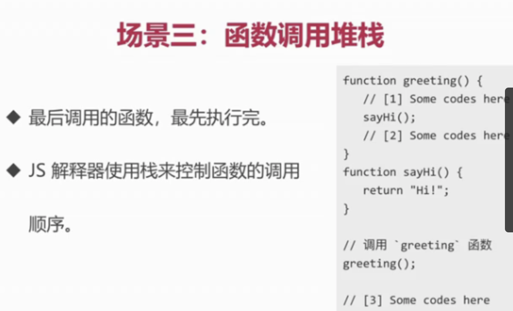
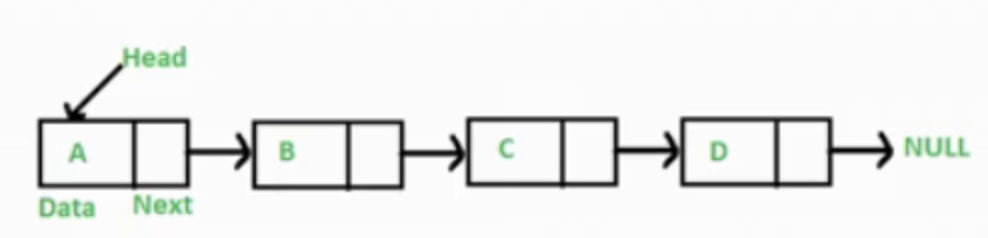

# 1. 数据结构与算法

<!-- TOC -->

- [1. 数据结构与算法](#1-数据结构与算法)
  - [1.1. 技巧总结](#11-技巧总结)
  - [1.2. 数据结构与算法简介](#12-数据结构与算法简介)
    - [1.2.1. 三部曲](#121-三部曲)
    - [1.2.2. 简介](#122-简介)
    - [1.2.3. 关系](#123-关系)
    - [1.2.4. 如何刷leetcode](#124-如何刷leetcode)
    - [1.2.5. 如何做题](#125-如何做题)
  - [1.3. 时间空间复杂度计算](#13-时间空间复杂度计算)
    - [1.3.1. 时间复杂度计算](#131-时间复杂度计算)
      - [1.3.1.1. 代码举例](#1311-代码举例)
    - [1.3.2. 空间复杂度计算](#132-空间复杂度计算)
  - [1.4. 数据结构之栈](#14-数据结构之栈)
    - [1.4.1. 栈简介](#141-栈简介)
    - [1.4.2. 什么场景下用栈](#142-什么场景下用栈)
      - [1.4.2.1. 场景一: 十进制转二进制](#1421-场景一-十进制转二进制)
      - [1.4.2.2. 场景二: 有效的括号](#1422-场景二-有效的括号)
      - [1.4.2.3. 场景三: 函数调用堆栈](#1423-场景三-函数调用堆栈)
    - [1.4.3. LeetCode-20.有效的括号](#143-leetcode-20有效的括号)
      - [1.4.3.1. 解题思路](#1431-解题思路)
      - [1.4.3.2. 解题步骤](#1432-解题步骤)
    - [1.4.4. 前端与栈: JS中的函数调用堆栈](#144-前端与栈-js中的函数调用堆栈)
    - [1.4.5. 栈总结](#145-栈总结)
  - [1.5. 数据结构之队列](#15-数据结构之队列)
    - [1.5.1. 队列简介](#151-队列简介)
    - [1.5.2. 队列场景](#152-队列场景)
      - [1.5.2.1. 场景一: 食堂排队打饭](#1521-场景一-食堂排队打饭)
      - [1.5.2.2. 场景二: JS异步中的任务队列](#1522-场景二-js异步中的任务队列)
      - [1.5.2.3. 场景三: 计算最近请求次数](#1523-场景三-计算最近请求次数)
    - [1.5.3. LeetCode: 933:计算最近请求次数](#153-leetcode-933计算最近请求次数)
      - [1.5.3.1. 解题思](#1531-解题思)
      - [1.5.3.2. 解题步](#1532-解题步)
    - [1.5.4. 前端与队列: JS中异步任务队列](#154-前端与队列-js中异步任务队列)
      - [1.5.4.1. 事件循环与任务队列](#1541-事件循环与任务队列)
  - [1.6. 数据结构之链表](#16-数据结构之链表)
    - [1.6.1. 链表简介](#161-链表简介)
      - [1.6.1.1. 为什么不用数组代替链表，还搞指针那么麻烦](#1611-为什么不用数组代替链表还搞指针那么麻烦)
      - [1.6.1.2. JS中的链表](#1612-js中的链表)
    - [1.6.2. LeetCode 237. 删除链表中的节点](#162-leetcode-237-删除链表中的节点)
      - [1.6.2.1. 题目描述](#1621-题目描述)
      - [1.6.2.2. 解题路](#1622-解题路)
      - [1.6.2.3. 步骤](#1623-步骤)
    - [1.6.3. LeetCode 206反转链表](#163-leetcode-206反转链表)
      - [1.6.3.1. 题目描](#1631-题目描)
      - [1.6.3.2. 思路](#1632-思路)
      - [1.6.3.3. 题步骤](#1633-题步骤)
    - [1.6.4. LeetCode 2.两数相加](#164-leetcode-2两数相加)
      - [1.6.4.1. l思路](#1641-l思路)
      - [1.6.4.2. 解ti](#1642-解ti)
    - [1.6.5. LeetCode 83.删除排序链表中的重复元素](#165-leetcode-83删除排序链表中的重复元素)
      - [1.6.5.1. 描述](#1651-描述)
      - [1.6.5.2. silu](#1652-silu)
      - [1.6.5.3. 步骤1](#1653-步骤1)
    - [1.6.6. LeetCode 141.环形链表](#166-leetcode-141环形链表)
      - [1.6.6.1. 描述141](#1661-描述141)
      - [1.6.6.2. 思路141](#1662-思路141)
      - [1.6.6.3. 步骤141](#1663-步骤141)
      - [1.6.6.4. code](#1664-code)
    - [1.6.7. 前端与链表中结合点：JS原型链](#167-前端与链表中结合点js原型链)
      - [1.6.7.1. 原型链简介](#1671-原型链简介)
      - [1.6.7.2. coding](#1672-coding)
      - [1.6.7.3. 原型链知识点](#1673-原型链知识点)
      - [1.6.7.4. 面试题一： 简述instanceof的原理，并用代码实现](#1674-面试题一-简述instanceof的原理并用代码实现)
      - [1.6.7.5. 面试题二](#1675-面试题二)
    - [1.6.8. 前端与链表: 使用链表指针获取JSON的节点值](#168-前端与链表-使用链表指针获取json的节点值)
  - [1.7. 数据结构之集合](#17-数据结构之集合)
    - [1.7.1. 集合简介](#171-集合简介)
      - [1.7.1.1. 集合是什么？](#1711-集合是什么)
      - [1.7.1.2. coding-](#1712-coding-)
    - [1.7.2. LeetCode 349.两个数组的交集](#172-leetcode-349两个数组的交集)
      - [1.7.2.1. 描述：给定两个数组，编写一个函数来计算它们的交集](#1721-描述给定两个数组编写一个函数来计算它们的交集)
    - [1.7.3. 前端与集合：使用ES6中Set](#173-前端与集合使用es6中set)
  - [1.8. 数据结构之字典](#18-数据结构之字典)
    - [1.8.1. 字典简介](#181-字典简介)
      - [1.8.1.1. 字典与对象的区别](#1811-字典与对象的区别)
    - [1.8.2. LeetCode. 349.两个数组的交集](#182-leetcode-349两个数组的交集)
      - [1.8.2.1. 思.路](#1821-思路)
      - [1.8.2.2. 步.骤](#1822-步骤)
    - [1.8.3. LeetCode. 20有效的括号](#183-leetcode-20有效的括号)
    - [1.8.4. LeetCode. 1两数之和](#184-leetcode-1两数之和)
      - [1.8.4.1. 题目要求](#1841-题目要求)
      - [1.8.4.2. 解决思路](#1842-解决思路)
      - [1.8.4.3. 具体步骤](#1843-具体步骤)
    - [1.8.5. LeetCode. 3.无重复字符的最长字串](#185-leetcode-3无重复字符的最长字串)
      - [1.8.5.1. 思..路](#1851-思路)
      - [1.8.5.2. 步..骤](#1852-步骤)
    - [1.8.6. LeetCode. 76.最小覆盖子串](#186-leetcode-76最小覆盖子串)
      - [1.8.6.1. 题目描述了](#1861-题目描述了)
      - [1.8.6.2. -思路](#1862--思路)
      - [1.8.6.3. -步骤](#1863--步骤)
  - [1.9. 数据结构之树](#19-数据结构之树)
    - [1.9.1. 树是什么](#191-树是什么)
    - [1.9.2. 树的深度与广度优先遍历](#192-树的深度与广度优先遍历)
      - [1.9.2.1. 什么是深度/广度优先遍历](#1921-什么是深度广度优先遍历)
      - [1.9.2.2. 深度优先遍历算法口诀](#1922-深度优先遍历算法口诀)
      - [1.9.2.3. 广度优先遍历算法口诀](#1923-广度优先遍历算法口诀)
    - [1.9.3. 二叉树的先中后序遍历](#193-二叉树的先中后序遍历)
      - [1.9.3.1. 二叉树是什么](#1931-二叉树是什么)
      - [1.9.3.2. 先序遍历算法口诀](#1932-先序遍历算法口诀)
      - [1.9.3.3. 中序遍历算法口诀](#1933-中序遍历算法口诀)
      - [1.9.3.4. 后序遍历算法口诀](#1934-后序遍历算法口诀)
    - [1.9.4. 二叉树的先中后序遍历(非递归版)](#194-二叉树的先中后序遍历非递归版)
    - [1.9.5. LeetCode 104.二叉树的最大深度](#195-leetcode-104二叉树的最大深度)
      - [1.9.5.1. 题目-描述](#1951-题目-描述)
      - [1.9.5.2. 解题思路](#1952-解题思路)
      - [1.9.5.3. 解题步骤](#1953-解题步骤)
    - [1.9.6. LeetCode 111.二叉树的最小深度](#196-leetcode-111二叉树的最小深度)
      - [1.9.6.1. 解题思路-](#1961-解题思路-)
      - [1.9.6.2. 解题步骤-](#1962-解题步骤-)
    - [1.9.7. LeetCode 102.二叉树的层序遍历](#197-leetcode-102二叉树的层序遍历)
      - [1.9.7.1. 思路](#1971-思路)
      - [1.9.7.2. 步骤](#1972-步骤)
    - [1.9.8. LeetCode 94. 二叉树的中序遍历](#198-leetcode-94-二叉树的中序遍历)
    - [1.9.9. LeetCode 112.路径总和](#199-leetcode-112路径总和)
      - [1.9.9.1. 解题思路](#1991-解题思路)
      - [1.9.9.2. 步骤112](#1992-步骤112)
    - [1.9.10. 前端与树：遍历JSON的所有节点值](#1910-前端与树遍历json的所有节点值)
    - [1.9.11. 前端与树：渲染Antd的树组件](#1911-前端与树渲染antd的树组件)
  - [1.10. 数据结构之图](#110-数据结构之图)
    - [1.10.1. 图简介](#1101-图简介)
      - [1.10.1.1. 图是什么](#11011-图是什么)
      - [1.10.1.2. 图的深度广度优先遍历](#11012-图的深度广度优先遍历)
      - [1.10.1.3. 深度优先遍历算法口诀-](#11013-深度优先遍历算法口诀-)
      - [1.10.1.4. 广度优先遍历算法口诀-](#11014-广度优先遍历算法口诀-)
    - [1.10.2. Leetcode.65.有效数字](#1102-leetcode65有效数字)
      - [1.10.2.1. 解题步骤](#11021-解题步骤)
    - [1.10.3. Leetcode.417.太平洋大西洋水流问题](#1103-leetcode417太平洋大西洋水流问题)
      - [1.10.3.1. jie解题步骤](#11031-jie解题步骤)
    - [1.10.4. Leetcode.133.克隆图](#1104-leetcode133克隆图)
      - [1.10.4.1. 解题思路](#11041-解题思路)
      - [1.10.4.2. 解题步骤](#11042-解题步骤)
  - [1.11. 数据结构之堆](#111-数据结构之堆)
    - [1.11.1. 堆简介](#1111-堆简介)
      - [1.11.1.1. 堆是什么](#11111-堆是什么)
      - [1.11.1.2. JS中的堆](#11112-js中的堆)
      - [1.11.1.3. 堆的应用](#11113-堆的应用)
      - [1.11.1.4. 第K个最大元素(没听懂？？？？)](#11114-第k个最大元素没听懂)
    - [1.11.2. JS实现：最小堆类](#1112-js实现最小堆类)
      - [1.11.2.1. 实现步骤](#11121-实现步骤)
      - [1.11.2.2. 插入](#11122-插入)
      - [1.11.2.3. 删除堆顶](#11123-删除堆顶)
      - [1.11.2.4. 获取堆顶和堆的大小](#11124-获取堆顶和堆的大小)
    - [1.11.3. Leetcode.215.数组中的第K个最大元素](#1113-leetcode215数组中的第k个最大元素)
      - [1.11.3.1. 题目描述215](#11131-题目描述215)
      - [1.11.3.2. 思-路](#11132-思-路)
      - [1.11.3.3. 步,骤](#11133-步骤)
    - [1.11.4. Leetcode.347.前k个高频元素](#1114-leetcode347前k个高频元素)
    - [1.11.5. Leetcode.23.合并k个排序链表](#1115-leetcode23合并k个排序链表)
      - [1.11.5.1. 思路](#11151-思路)
      - [1.11.5.2. 解题步骤](#11152-解题步骤)
  - [1.12. 进阶算法之搜索排序](#112-进阶算法之搜索排序)
    - [1.12.1. 排序和搜索简介](#1121-排序和搜索简介)
      - [1.12.1.1. 排序和搜索是什么](#11211-排序和搜索是什么)
      - [1.12.1.2. JS中的排序和搜索](#11212-js中的排序和搜索)
      - [1.12.1.3. 排序算法](#11213-排序算法)
      - [1.12.1.4. 搜索算法](#11214-搜索算法)
    - [1.12.2. JS实现-冒泡排序](#1122-js实现-冒泡排序)
      - [1.12.2.1. 冒泡排序的思路](#11221-冒泡排序的思路)
      - [1.12.2.2. 冒泡排序的时间复杂度](#11222-冒泡排序的时间复杂度)
    - [1.12.3. JS实现-选择排序](#1123-js实现-选择排序)
      - [1.12.3.1. 选择排序的思路](#11231-选择排序的思路)
      - [1.12.3.2. 选择排序的时间复杂度](#11232-选择排序的时间复杂度)
    - [1.12.4. JS实现-插入排序](#1124-js实现-插入排序)
      - [1.12.4.1. 插入排序的思路](#11241-插入排序的思路)
      - [1.12.4.2. 插入排序的时间复杂度](#11242-插入排序的时间复杂度)
    - [1.12.5. JS实现-归并排序](#1125-js实现-归并排序)
      - [1.12.5.1. 归并排序的思路](#11251-归并排序的思路)
      - [1.12.5.2. 合并两个有序数组](#11252-合并两个有序数组)
      - [1.12.5.3. 归并排序的时间复杂度](#11253-归并排序的时间复杂度)
    - [1.12.6. JS实现-快速排序](#1126-js实现-快速排序)
      - [1.12.6.1. 快速排序的思路](#11261-快速排序的思路)
      - [1.12.6.2. 快速排序的时间复杂度](#11262-快速排序的时间复杂度)
    - [1.12.7. JS实现-顺序搜索](#1127-js实现-顺序搜索)
      - [1.12.7.1. 顺序搜索的思路](#11271-顺序搜索的思路)
      - [1.12.7.2. 顺序搜索的时间复杂度](#11272-顺序搜索的时间复杂度)
    - [1.12.8. JS实现-二分搜索](#1128-js实现-二分搜索)
      - [1.12.8.1. 二分搜索的思路](#11281-二分搜索的思路)
      - [1.12.8.2. 二分搜索的时间复杂度](#11282-二分搜索的时间复杂度)
    - [1.12.9. leetCode21.合并两个有序链表](#1129-leetcode21合并两个有序链表)
      - [1.12.9.1. 解题思路](#11291-解题思路)
      - [1.12.9.2. 解题步骤](#11292-解题步骤)
    - [1.12.10. LeetCode.374.猜数字大小(二分搜索循环版)](#11210-leetcode374猜数字大小二分搜索循环版)
      - [1.12.10.1. 解题思路](#112101-解题思路)
      - [1.12.10.2. 解题步骤](#112102-解题步骤)
    - [1.12.11. 思考：chrome最新的Array.prototype.sort内部是用的什么排序算法？](#11211-思考chrome最新的arrayprototypesort内部是用的什么排序算法)
  - [1.13. 算法设计思想之“分而治之”](#113-算法设计思想之分而治之)
    - [1.13.1. 分而治之简介](#1131-分而治之简介)
      - [1.13.1.1. 分而治之是什么](#11311-分而治之是什么)
      - [1.13.1.2. 应用场景一 归并排序](#11312-应用场景一-归并排序)
      - [1.13.1.3. 应用场景二 快速排序](#11313-应用场景二-快速排序)
    - [1.13.2. LeetCode.374.猜数字大小(分而治之递归版)](#1132-leetcode374猜数字大小分而治之递归版)
      - [1.13.2.1. 解题思路374](#11321-解题思路374)
      - [1.13.2.2. 步骤374](#11322-步骤374)
    - [1.13.3. LeetCode.226.翻转二叉树(分而治之递归版)](#1133-leetcode226翻转二叉树分而治之递归版)
      - [1.13.3.1. 解题思路](#11331-解题思路)
      - [1.13.3.2. 步骤解题](#11332-步骤解题)
    - [1.13.4. LeetCode.100.相同的树(分而治之递归版)](#1134-leetcode100相同的树分而治之递归版)
      - [1.13.4.1. 解体思路](#11341-解体思路)
      - [1.13.4.2. 解题步骤](#11342-解题步骤)
    - [1.13.5. LeetCode.101.对称二叉树(分而治之递归版)](#1135-leetcode101对称二叉树分而治之递归版)
      - [1.13.5.1. 解题思路](#11351-解题思路)
      - [1.13.5.2. 解题步骤](#11352-解题步骤)
  - [1.14. 算法设计思想之“动态规划”](#114-算法设计思想之动态规划)
    - [1.14.1. 动态规划简介](#1141-动态规划简介)
      - [1.14.1.1. 动态规划是什么](#11411-动态规划是什么)
      - [1.14.1.2. 什么是相互重叠的子问题](#11412-什么是相互重叠的子问题)
    - [1.14.2. LeetCode.70.爬楼梯问题](#1142-leetcode70爬楼梯问题)
      - [1.14.2.1. 解题思路](#11421-解题思路)
      - [1.14.2.2. 解题步骤](#11422-解题步骤)
    - [1.14.3. LeetCode.198.打家劫舍](#1143-leetcode198打家劫舍)
      - [1.14.3.1. 解题思路](#11431-解题思路)
      - [1.14.3.2. 解题步骤](#11432-解题步骤)
  - [1.15. 算法设计思想之“贪心算法”](#115-算法设计思想之贪心算法)
    - [1.15.1. 贪心算法简介](#1151-贪心算法简介)
      - [1.15.1.1. 问题1:零钱兑换](#11511-问题1零钱兑换)
      - [1.15.1.2. 问题2: 珍珑棋局](#11512-问题2-珍珑棋局)
    - [1.15.2. LeetCode.455.分饼干](#1152-leetcode455分饼干)
      - [1.15.2.1. 解题思路](#11521-解题思路)
      - [1.15.2.2. 解题步骤](#11522-解题步骤)
    - [1.15.3. LeetCode.122.买卖股票的最佳时机II](#1153-leetcode122买卖股票的最佳时机ii)
      - [1.15.3.1. 解题思路](#11531-解题思路)
      - [1.15.3.2. 解题步骤](#11532-解题步骤)
  - [1.16. 算法设计思想之“回溯算法”](#116-算法设计思想之回溯算法)
    - [1.16.1. 回溯算法简介](#1161-回溯算法简介)
      - [1.16.1.1. 回溯算法是什么](#11611-回溯算法是什么)
      - [1.16.1.2. 什么问题适合用回溯算法解决](#11612-什么问题适合用回溯算法解决)
      - [1.16.1.3. 问题1: 全排列](#11613-问题1-全排列)
    - [1.16.2. LeetCode.46.全排列](#1162-leetcode46全排列)
      - [1.16.2.1. 解题思路](#11621-解题思路)
      - [1.16.2.2. 解题步骤](#11622-解题步骤)
    - [1.16.3. LeetCode.78.子集](#1163-leetcode78子集)
      - [1.16.3.1. 解题思路](#11631-解题思路)
      - [1.16.3.2. 解题步骤](#11632-解题步骤)
  - [1.17. 总结](#117-总结)
    - [1.17.1. 经验](#1171-经验)
    - [1.17.2. 拓展建议](#1172-拓展建议)

<!-- /TOC -->


## 1.1. 技巧总结

1. 写排序算法涉及到循环嵌套，循环嵌套逻辑很绕，单循环与嵌套循环通用的一个编写技巧就是先写外环中单次要做的逻辑(不要写外循环结构)，单次要做的逻辑写清楚之后，然后向外补充外循环逻辑，多次外循环做那个单次逻辑的事，就ok了

## 1.2. 数据结构与算法简介

### 1.2.1. 三部曲

- 理论: 数据结构与算法的特点，应用场景，JS实现，时间/空间复杂度等
  - 数据结构:
    1. 栈
    2. 队列
    3. 集合
    4. 链表
    5. 字典
    6. 树
    7. 图
    8. 堆
  - 算法:
    1. 冒泡算法
    2. 选择算法
    3. 插入算法
    4. 归并算法
    5. 快速算法
    6. 顺序算法
    7. 二分搜索
  - 算法设计思想:
    - 分而治之
    - 动态规划
    - 贪心
    - 回溯
- 刷题: 做一些算法题，推荐leetcode
  - 通过刷题网站:推荐按照类型刷题，相当于集中训练
  - 重点关注:通用套路。时间/空间复杂度分析和优化
- 实战: 在工作中与数据结构算法打交道
  - 前端与数据结构/算法的结合点
  - 在工作中与数据结构算法打交道

### 1.2.2. 简介

- 数据结构：计算机存储，组织数据的方式就像锅碗瓢盆
- 算法: 一系列解决问题的清晰指令，就像食谱

### 1.2.3. 关系

- 程序 = 数据结构 + 算法
- 数据结构为算法提供服务，算法围绕数据结构操作
- 将要学习的算法
  - 链表: 遍历链表，删除链表节点
  - 树 图: 深度广度优先遍历
  - 数组: 冒泡/选择/插入/归并/快速排序，顺序/二分搜索
  - 等等

### 1.2.4. 如何刷leetcode

- 通过题号搜索
- 通过难度状态列表标签筛选搜索题目
- 通过企业搜索

### 1.2.5. 如何做题

## 1.3. 时间空间复杂度计算

### 1.3.1. 时间复杂度计算

- 就是一个函数，用大O表示，比如O(1), O(n), O(logN)...
- 就是看他执行多少次呗
- 定性描述该算法的运行时间(不是指具体的运行时间而是一个函数来表示的趋势图的运行时间趋势)
  

#### 1.3.1.1. 代码举例

```javascript
/**
 * O(1)的例子
 * 这两行代码时间复杂度就是O(1)，因为每次执行的时候这两行代码永远只会被执行一次，他里面没有任何循环之类的，所以他就是O(1),类似y=常量 这条函数图形
*/
let i = 0;
i += 1;

/**
 * O(n)的例子
 * 这是for循环了n次，每次循环时候都打印了一下，共会打印执行n次，就类似 y= x 这条正比例函数图形
*/
for(let i = 0; i<n; i+=1) {
  console.log(i)
}

/**
 * O(1)+O(n)=O(n)
 * 计算时间复杂度的时候，如果两个复杂度先后排列我们就把他们相加，而且我们取那个增长趋势更快的时间复杂度。如下面O(n)足够大的时候1就可以忽略不及了
*/
let i = 0;
i += 1;
for (let j=0;j<n;j+=1) {
  console.log(j)
}

/**
 * O(n)*O(n)=O(n^2)
 *  嵌套循环的话，就让两个复杂度相乘
*/
for (let i = 0; i<n;i+=1) {
  for(let j=0;j<n;j+=1) {
    console.log(i,j)
  }
}

/**
 * O(logN)
*/
let i = 1;
while(i<n) {
  console.log(i);
  i *= 2;
}
```

### 1.3.2. 空间复杂度计算

- 一个函数，用大O表示，比如O(1),O(n),O(n^2)...
- 算法在运行过程中临时占用存储空间大小的量度

```javascript
/**
 * O(1)
 * 只声明了单个变量，单个变量所占内存永远是1，是恒定的一个内存
*/
let i = 0;
i += 1;

/**
 * O(n)
 * 它声明了list一个数组，我们给数组里面添加了n个变量值，相当于占了n个内存单元，所以这段代码空间复杂度占了O(n)
*/
const list = [];
for (let i = 0; i<n; i+=1) {
  list.push(i);
}

/**
 * O(n^2)
 * 下面是个矩阵，矩阵的空间复杂度就是n的二次方，他嵌套了两层的数组，存储了n的二次方个变量所以是这个空间复杂度
*/
const matrix = [];
for (let i = 0; i<n; i+=1) {
  matrix.push([]);
  for(let j = 0; j<n; j+=1) {
    matrix[i].push(j)
  }
}
```

## 1.4. 数据结构之栈

### 1.4.1. 栈简介

- 栈是什么
  - 一个先进后出的数据结构
  - js中没有栈这个结构，java中有这个结构，但可以用Array实现栈的所有功能

代码实现  见stack文件夹indexjs文件

### 1.4.2. 什么场景下用栈

- 需要先进后出的场景
  - 比如十进制转二进制，判断字符串的括号是否有效，函数调用堆栈...

#### 1.4.2.1. 场景一: 十进制转二进制


#### 1.4.2.2. 场景二: 有效的括号

这个算法就是我们vscode编辑器里那个括号有效闭合的检查插件的算法，当出现括号不有效的闭合缺一半多一半的话编辑器都会提示。


#### 1.4.2.3. 场景三: 函数调用堆栈

这个也是一个先进后出的栈的使用场景，函数嵌套放进栈里，最后入栈的函数都是最先被调用的，执行中的函数走入栈操作，对应的函数执行完毕会其自动出栈操作，最后栈里是空的自然状态才对，先进后出的顺序



### 1.4.3. LeetCode-20.有效的括号

#### 1.4.3.1. 解题思路

- 对于没有闭合的左括号而言，越靠后的左括号，对应的右括号越靠近 如“{[]}” 为true
- 满足后进先出，考虑用栈数据结构来解题

#### 1.4.3.2. 解题步骤

1. 新建一个栈
2. 扫描字符串，遇左括号入栈，遇到(和栈顶括号类型匹配的)右括号就把栈顶括号出栈(js中是移出数组)，类型不匹配直接判定为不合法。(栈顶括号是最后一个推入栈的括号为栈顶)
3. 最后栈空了就合法，否则不合法

```javascript
// 分析可知，此段代码的时间复杂度:O(n),空间复杂度:O(n)
var isValid = function(s) {
  // 优化判断
  if (s.length % 2 === 1) {return false}
  const stack = [];
  for (let i = 0; i < s.length; i++) {
    const c = s[i];
    if (c === '(' || c === '{' || c === '[') {
      stack.push(c);
    }
    else {
      const t = stack[stack.length - 1];
      if ((t === '(' && c === ')') || (t === '{' && c === '}') || (t === '[' && c === ']')) {
        stack.pop();
      }
      else {
        return false;
      }
    }
  }
  return stack.length === 0
}
// 上面用栈结构用时花了72ms，太久了，要是用字典的数据结构还能更加减少用时，后面学了再来优化
```

### 1.4.4. 前端与栈: JS中的函数调用堆栈

背后的js解释器就用了栈这种数据结构来控制js函数的调用顺序，使他能够满足后进先出的特性

见stack/callStackjs文件

在该文件函数调用中选中红点按F5打下断点看它的CALL STACK 的入栈出栈过程，清楚地看见他的过程就行了

### 1.4.5. 栈总结

- 栈的常用操作: push(入) pop(出)，stack[stack.length -1](栈顶元素)

## 1.5. 数据结构之队列

### 1.5.1. 队列简介

- 队列是一个先进先出的数据结构(像打饭排队的情形)
- js中没有队列，但可以用Array实现队列的所有功能

> 见queue文件夹

### 1.5.2. 队列场景

- 所有需要先进先出的场景
- 比如: 食堂排队打饭，JS异步中的任务队列，计算最近请求次数

#### 1.5.2.1. 场景一: 食堂排队打饭

- 食堂只留一个窗口，学生排队打饭似春运
- 先进先出，保证有序

#### 1.5.2.2. 场景二: JS异步中的任务队列

- JS是单线程，无法同时处理异步中的并发任务
- 只能使用任务队列先后处理异步任务

#### 1.5.2.3. 场景三: 计算最近请求次数

输入: inputs = [[], [1], [100], [3001], [3002]]
输出: [null, 1,2,3,3]

- 有新请求就入队，3000ms前发出的请求出队
- 队列的长度就是最近请求次数

### 1.5.3. LeetCode: 933:计算最近请求次数

#### 1.5.3.1. 解题思

- 越早发出的请求越早不在最近3000ms内的请求里
- 满足先进先出，考虑用队列

#### 1.5.3.2. 解题步

- 有新请求就入队，3000ms之前发出的请求进行出队
- 队列的长度就是最近请求次数

```javascript
// 用构造函数去做，保证每次执行ping方法时都是操作的同一个对象
// 时间复杂度O(n)n是需要被踢出队的请求个数
// 空间复杂度O(n)n是队列数组q的长度
var RecentCounter = function () {
  this.q = [];
};
RecentCounter.prototype.ping = function (t) {
  this.q.push(t);
  // 把老请求给踢出去的
  while (this.q[0] < t - 3000) {
    this.q.shift();
  }
  return this.q.length;
}
```

### 1.5.4. 前端与队列: JS中异步任务队列

#### 1.5.4.1. 事件循环与任务队列

整个event Loop分3部分: JS引擎+WebAPIs+任务队列


- 根据图中箭头指向可知，当JS引擎(JS引擎分为堆和栈两块执行区)中执行js代码时，遇到异步任务时，js引擎就给它交给WebAPIs去处理，然后WebAPIs去依次执行这些异步任务，而且异步任务都会伴随着一个回调，当WebAPIs处理完异步时，会依次把回调放到任务队列CallbackQueue里面(先进先出)，最先排上队的回调会在当前宏任务结束前进入JS引擎中去执行，若在回调执行期间再次遇到异步任务时，会再交给WebAPIs处理从而完成循环。

- 队列常用操作: push , shift, queue[0]

## 1.6. 数据结构之链表

### 1.6.1. 链表简介

- 链表是什么
  - 多个元素组成的列表
  - 元素存储不连续，用next指针连在一起


#### 1.6.1.1. 为什么不用数组代替链表，还搞指针那么麻烦

- 数组: 增删非首尾元素时往往需要移动元素
- 链表: 增删非首尾元素，不需要移动元素，只需要更改next的指向即可。
  - 因为链表之间的存储不是连续的，元素之间用指针相联，所以我们想增删一个元素的话，只需要改下next指针即可

- 链表常用操作：修改next指针，遍历链表

#### 1.6.1.2. JS中的链表

- jS中没有链表
- 我们一般用Object模拟链表

> 建linkedList文件夹

### 1.6.2. LeetCode 237. 删除链表中的节点

#### 1.6.2.1. 题目描述


#### 1.6.2.2. 解题路

4-->5-->1-->9
(要删1)

- 无法直接获取被删除节点的上个节点(所以按常规删除链表节点方式(linkedList文件夹)不行，就是无法获取上个节点，这时换一种思路)
- 将被删除节点转移到下个节点

#### 1.6.2.3. 步骤

- 将被删除的节点值改为下个节点的值
- 删除下个节点

```javascript
var deleteNode = function(node) {
  node.val = node.next.val;
  node.next = node.next.next
}
// 这个function没有任何循环，所有时间复杂度是O(1)
// 由于function里没有数组和矩阵，所有空间复杂度也是O(1)
```

### 1.6.3. LeetCode 206反转链表

#### 1.6.3.1. 题目描

反转一个单链表

#### 1.6.3.2. 思路

- 若反转两个节点:将n+1的next指向n即可
- 若反转多个节点: 双指针遍历链表，重复上述操作

#### 1.6.3.3. 题步骤

- 双指针一前一后遍历链表
- 反转双指针

```javascript
// 输入: 1-->2-->3-->4-->5-->NULL
// 输出: 5-->4-->3-->2-->1-->NULL

var reverseList = function(head) {
  // head参数是整个链表的头部
  // 初始化2个指针
  let p1 = head;
  let p2 = null;
  while(p1) {
    conosle.log(p1.val, p2 && p2.val)
    const tmp = p1.next;
    p1.next = p2;
    p2 = p1;
    p1 = tmp;
  }
  return p2;
}
//因为有个while循环体，所以时间复杂度就是O(n)了
//算法中临时变量是单个值，没有数组也没有矩阵，所以空间复杂度是O(1)
```

### 1.6.4. LeetCode 2.两数相加

#### 1.6.4.1. l思路

- 小学数学题，模拟相加操作
- 需要遍历链表

#### 1.6.4.2. 解ti

- 新建一个空链表
- 遍历被相加的两个链表，模拟相加操作，将个位数追加到新链表上，将十位数留到下一位去相加

```javascript
// 创建空节点链表的一个构造函数
function ListNode(val) {
  this.val = val;
  this.next = null;
}

// 参数是输入的2个链表
var addTwoNumbers = function(l1,l2) {
  const l3 = new ListNode(0);//新建空节点的空链表
  let p1 = l1；//新建指针，初始指向l1 头部
  let p2 = l2；//这个指针指向第二个链表的头部
  let p3 = l3；//还需要个指针，指向我们新建的那个空链表(因为我们往新链表上追加元素的时候还是需要指针的--需要不停的指向l3链表的最后一个节点)
  let carry = 0;

  while(p1 || p2){
    const v1 = p1 ? p1.val : 0;
    const v2 = p2 ? p2.val : 0;
    const val = v1 + v2;
    // 获得满10上的10位数
    carry = Math.floor(val/10);
    // 获得个位上的数
    p3.next = new ListNode(val % 10);

    if (p1) p1 = p1.next;
    if (p2) p2 = p2.next;
    p3 = p3.next;
  }
  if (carry) p3.next = new ListNode(carry);
  return l3.next;
}
// 时间复杂度:O(n) 里面有个while循环体,n就是l1 l2两个链表的长度的较大值，它循环次数自然就是l1或l2较长的那个长度
// 空间复杂度:O(n) n也是两个链表的长度的较大者虽然没有数组矩阵，但是又一个新造的链表的构造函数这个链表的长度有可能是l1l2中较长的那个长度还有可能是相加的长度，但不会有线性增长，所以是O(n)
```

### 1.6.5. LeetCode 83.删除排序链表中的重复元素

#### 1.6.5.1. 描述

给定一个排序链表，删除所有重复的元素，使每个元素只出现一次
如输入1->1->2  输出1->2

#### 1.6.5.2. silu

- 因为链表是有序的，所以重复的元素一定相邻
- 遍历链表，如果发现当前元素和下个元素值相同，就删除下个元素值

#### 1.6.5.3. 步骤1

- 遍历链表，如果发现当前元素和下个元素值相同，就删除下个元素值
- 遍历结束后，返回原链表的头部即可

```javascript
// 因为要遍历链表，所以就得建个指针
var deleteDuplication = function(head) {
  // 因为要遍历链表，所以就得建个指针
  let p = head;
  while(p && p.next) {
    if (p.val === p.next.val) {
      p.next = p.next.next;
    }
    else {
      p = p.next;
    }
  }
  return head;
}
// 时间复杂度O(n): 有while循环体
// 空间复杂度O(1): 没有额外的存储任何线性增长变量没有数组没有矩阵也没有链表
```

### 1.6.6. LeetCode 141.环形链表

#### 1.6.6.1. 描述141

给定一个链表，判断链表中是否有环，为了表示给定链表中的环，我们使用整数pos来表示链表尾链接到链表中的位置(索引从0开始)，
如果pos是-1，则在该链表中没有环。

#### 1.6.6.2. 思路141

- 两个人在圆形操场上的起点同时起跑，速度快的人一定会超过速度慢的人一圈
- 用一快一慢两个指针遍历链表，如果指针能够相逢，那么链表就有圈
  - 快指针用next指针走两步，慢指针用next走1步代替即可

#### 1.6.6.3. 步骤141

- 用一快一慢两个指针遍历链表，如果指针能够相逢，就返回true
- 遍历结束后，还没有相逢就返回false

#### 1.6.6.4. code

```javascript
// 因为要遍历链表，所以就得建个指针
var hasCycle = function(head) {
  let p1 = head;
  let p2 = head;
  while (p1 && p2 && p2.next) {
    p1 = p1.next;
    p2 = p2.next.next;
    // 如果相逢
    if (p1 === p2) {
      return true;
    }
  }
  return false;
}
// 测试用例时候，输入：[3,2,0,-4] pos为1， 输出：从末尾-4开始，连链表中1位能连成个圈就为true，若连-1位的话肯定就连不成圈

// 时间复杂度O(n): 有while循环体，哪怕是2n 3n只要不是n的平方就都是一个量级的，为O(n)量级
// 空间复杂度O(1): 没有额外的存储任何线性增长的数据结构--没有数组没有矩阵也没有链表
```

### 1.6.7. 前端与链表中结合点：JS原型链

#### 1.6.7.1. 原型链简介

- 原型链的本质就是链表
- 原型链上的节点是各种原型对象，js中有各种内置的类如stringfunction，比如Function.prototype, Object.prototype......
- 原型链通过_proto_属性链接各种原型对象

- 原型链长啥样(切记是指向构造函数的原型对象不是指向构造函数obj.__proto__指向Object的原型对象)
  - obj -> Object.prototype -> null (对象原型链到此结束)
  - func -> Function.prototype -> Object.prototype -> null (函数原型链到此结束)
  - arr -> Array.prototype -> Object.prototype -> null (数组原型链到此结束)
    - arr.__proto__ === Array.prototype true
  - 其他string，number都是先指向自己构造函数，然后再指向Object，然后再指向null

#### 1.6.7.2. coding

见linkedList/protojs文件

#### 1.6.7.3. 原型链知识点

- 如果A沿着原型链能找到B.prototype,那么A instanceof B 为true；(如obj instanceof Object 为true);
  - func instanceof Function 为true，func instanceof Object 为true
- 如果在A对象(包括函数数组对象等实例等对象实例)上没有找到x属性，那么会沿着原型链找x属性

#### 1.6.7.4. 面试题一： 简述instanceof的原理，并用代码实现

- 用到的知识点： 如果A沿着原型链能找到B.prototype,那么A instanceof B 为true
- 解法：遍历A的原型链，如果能找到B.prototype,返回true 否则返回false（遍历原型链与遍历链表差不多）

见linkedList/protojs文件

#### 1.6.7.5. 面试题二

```javascript
var foo ={},
    F = function(){};
Object.prototype.a = 'value a';
Function.prototype.b = 'value b';

console.log(foo.a);// value a
console.log(foo.b);// undefined

console.log(F.a);// value a
console.log(F.b);// value b

```

### 1.6.8. 前端与链表: 使用链表指针获取JSON的节点值

把遍历链表的创建指针的思想原理应用到前端工作中
见linkedList/json.js文件

## 1.7. 数据结构之集合

### 1.7.1. 集合简介

#### 1.7.1.1. 集合是什么？

- 一种无序且唯一的数据结构
前面讲的栈队列链表都是有序的数据结构，没有什么先后顺序没有什么next指针。集合里面的元素都是唯一的。
之前栈里的队列链表等里的元素都是可以允许重复的。集合中要求里面的元素必须都是唯一的不能出现重复
- ES6中有集合，名为Set。
- 集合的常用操作: 去重，判断某元素是否在集合中，求集合之间的交集...

#### 1.7.1.2. coding-

见set/indexjs文件

### 1.7.2. LeetCode 349.两个数组的交集

#### 1.7.2.1. 描述：给定两个数组，编写一个函数来计算它们的交集

- 思路
  - 求交集且无序唯一
  - 应该使用集合来解这道题
- 步骤
  - 先用集合对nums1去重
  - 遍历nums1，筛选出nums2也包含的值

```javascript
var intersection = function(nums1,nums2) {
  return [...new Set(nums1)].filter(n => nums2.includes(n));
}
// 时间复杂度：O(n²) 因为是循环嵌套fiter里面套includes循环
// 空间复杂度：O(m) m就是nums1去重后的空间复杂度
```

### 1.7.3. 前端与集合：使用ES6中Set

- 使用Set对象: new, add, delete, has, size
- 迭代Set: 多种迭代方法，Set与Array互转，求交集/差集

见set/setjs文件

## 1.8. 数据结构之字典

### 1.8.1. 字典简介

- 与集合类似，字典也是一种存储唯一值的数据结构，但它是以键值对的形式来存储。
  - 键值对是字典最重要的特性，它可以做各种映射关系
- ES6中有字典，名为Map
- 字典的常用操作：键值对的增删改查

#### 1.8.1.1. 字典与对象的区别

- https://zhuanlan.zhihu.com/p/88914806
- https://blog.csdn.net/ckwang6/article/details/89215396

见map/indexjs文件

### 1.8.2. LeetCode. 349.两个数组的交集

#### 1.8.2.1. 思.路

- 求nums1和nums2都有的值
- 用字典建立一个映射关系，记录nums1里有的值。(key代表数组里的值，value代表是否交集book值)
- 遍历nums2，找出nums1里也有的值

#### 1.8.2.2. 步.骤

- 新建一个字典，遍历nums1，填充字典
- 遍历nums2，遇到字典里的值就选出，并从字典中删除

```javascript
var intersection = function(nums1,nums2) {
  const map = new Map();
  nums1.forEach(n => {
    map.set(n, true);
  })
  const res = [];
  nums2.forEach(n => {
    if (map.get(n)) {
      res.push(n);
      map.delete(n);
    }
  })
}

// 时间复杂度：O(m+n)  ====有两个for循环但是没嵌套是并列的，就应该是nums1的长度m加上nums2的长度n
// 空间复杂度： 空间复杂度是指临时变量的一个消耗，我们中间一个临时变量是map一个字典，字典虽然不是数组
// 也不是矩阵，但是它存储的值也有可能是线性增长的，所以这个算法的空间复杂度是O(m)
```

### 1.8.3. LeetCode. 20有效的括号

- 用字典解答这个算法题，会比之前用栈解决的性能更好，做的优化

```javascript
var isValid = function(s) {
  // 优化判断
  if (s.length % 2 === 1) {return false}
  const stack = [];

  const map = new Map();
  map.set('(', ')');
  map.set('{', '}');
  map.set('[', ']');

  for (let i = 0; i < s.length; i++) {
    const c = s[i];
    if (map.has(c)) {
      stack.push(c);
    }
    else {
      const t = stack[stack.length - 1];
      if (map.get(t) === c) {
        stack.pop();
      }
      else {
        return false;
      }
    }
  }
  return stack.length === 0
}
// 时间复杂度：O(n)
// 空间复杂度：O(n) :虽然有字典，但这个map是一个常量级的O(1)的一个空间复杂度，因为它不会随着某个变量的增加而增加，它的长度永远都是3，所以这个字典的加入不会改变整体的空间复杂度仍然是O(n)
```

### 1.8.4. LeetCode. 1两数之和

#### 1.8.4.1. 题目要求

```javascript

// 给定nums = [2, 7, 11, 15], target = 9;
// 因为nums[0] + nums[1] = 2 + 7 = 9;
// 所以返回 [0, 1];
```

#### 1.8.4.2. 解决思路

- 把nums想象成相亲者（如上例的2跟7就凑成了一对他们加起来就满足targets匹配条件，就是要找合适的一对或多对合适的情侣）
- 把targets想象成匹配条件
- 用字典建立一个婚姻介绍所，存储相亲者的数字和下标

#### 1.8.4.3. 具体步骤

- 新建一个字典作为婚姻介绍所
- nums里的值，逐个来介绍所找对象，没有合适的就先登记着，有合适的就牵手成功

```javascript
var twoSum = function (nums, target) {
  const map = new Map();
  for (let i = 0; i < nums.length; i+=1) {
    const n = nums[i];
    const n2 = target - n;
    if (map.has(n2)) {
      return [map.get(n2), i];
    }
    else {
      map.set(n, i);
    }
  }
}
// 时间复杂度：O(n)
// 空间复杂度：建立一个额外字典，要存不定量值，是一个线性增长的O(n);

// 但是上面解法是空间复杂度有点高，内存消耗至34MB左右很不理想，
// 后面用二分查找的知识可以优化一下=====达到时间换空间，把内存消耗降低，执行用时上稍微牺牲一下

```

### 1.8.5. LeetCode. 3.无重复字符的最长字串

- 给定一个字符串请你找出其中不含有重复字符的最长子串的长度
- 如输入('abcabcbb') 输出(3) 因为不含重复字符的最长子串是‘abc’，所以其长度为3

#### 1.8.5.1. 思..路

- 先找出所有的不包含重复字符的子串
- 找出长度最大那个子串，返回其长度即可

#### 1.8.5.2. 步..骤

输入('abcabcbb') 输出3

- 用双指针(左右指针:左指针跟踪起始位右指针跟踪终点位置)维护一个滑动窗口，用来剪切子串
  - 所谓双指针就是两个变量用来记录子串的起始位置
- 不断移动右指针，遇到重复字符，就把左指针移动到重复字符的下一位
- 过程中，记录所有窗口的长度，并返回长度

```javascript
var lengthOfLongestSubstring = function (s) {
  let l = 0;// 左指针初始起始位置
  let res = 0;// 记录可随时更替的子串长度

  // 利用字典来记录当前滑动窗口中是否遇到重复字符
  const map = new Map();

  for(let r=0; r<s.length; r++) {
    if (map.has(s[r]) && map.get(s[r]) >= l) {
      // 把左指针移动到重复字符的下一位
      l = map.get(s[r]) + 1;
    }
    res = Math.max(res, r-l+1);
    map.set(s[r], r)
  }
  return res;
}
// 时间复杂度：O(n),里面有个for循环，
// 空间复杂度：O(m), m就是字符串中不重复字符的个数
```

### 1.8.6. LeetCode. 76.最小覆盖子串

#### 1.8.6.1. 题目描述了

给你一个字符串S，一个字符串T，请在字符串S里面找出：包含T所有字符的最小子串。
输入：S = ‘ADOBECODEBANC’， T= ‘ABC’
输出：‘BANC’

#### 1.8.6.2. -思路

- 先找出所有的包含T的子串
- 找出长度最小那个子串，返回即可。

#### 1.8.6.3. -步骤

- 用双指针维护一个滑动窗口
- 移动右指针，找到包含T的子串，移动左指针，尽量减少包含T的子串的长度
- 循环上述过程，移动过程中，记录所有满足要求的子串，从中找到最小子串返回即可

```javascript
var minWindow = function (s, t) {
  let l = 0;// 左指针
  let r = 0;// 右指针
  const need = new Map();// 建个字典表示子串的字符及各字符需要的个数
  for (let c of t) {
    need.set(c, need.has(c) ? need.get(c) + 1 : 1);
  }
  let needType = need.size;
  let res = '';
  while(r < s.length) {
    const c = s[r];
    if (need.has(c)) {
      need.set(c, need.get(c) - 1);
      if (need.get(c) === 0) needType -= 1;
    }
    while (needType === 0) {
      const newRes = s.substring(l, r + 1);
      if (!res || newRes.length < res.length) res = newRes;
      const c2 = s[l];
      if (need.has(c2)) {need.set(c2, need.get(c2) + 1)
        if (need.get(c2) === 1) needType += 1;
      }
      l += 1;
    }
    r += 1;
  }
  return res;
}
// 时间复杂度：O(m+n),m是t的长度，n是s的长度---先不考虑循环的嵌套关系，就想两个while循环干了啥事，就是在不断的移动右指针和左指针，两个指针基本上都是移动了n次(s的长度)
// 空间复杂度：O(k)  k是t里不同字符的个数，.里面有个字典，字典的长度是t字符串里面不同字符的个数，最坏的情况下最大等于s的长度
```

## 1.9. 数据结构之树

### 1.9.1. 树是什么

- 一种分层数据的抽象模型，在前端广泛应用
- 前端工作中常见的树包括DOM树，级联选择，树形控件...
- JS中没有树,但是可以用Object和Array构建树
- 树的常用操作: 深度/广度优先遍历，先中后序遍历
- 前端工作中常用深度优先遍历，剩下的遍历经常在面试中出现

### 1.9.2. 树的深度与广度优先遍历

#### 1.9.2.1. 什么是深度/广度优先遍历

- 深度优先遍历: 尽可能深的搜索树的分支 (就是一个递归实现)

- 广度优先遍历: 先访问离根节点最近的节点


#### 1.9.2.2. 深度优先遍历算法口诀

1. 访问根节点
2. 对根节点的children挨个进行深度优先遍历(递归实现)

> 见tree/dfs.js文件

#### 1.9.2.3. 广度优先遍历算法口诀

- 新建一个队列，把根节点入队
- 把队头出队并访问
- 把队头的children挨个入队
- 重复第二、三步，直到队列为空

> 见tree/bfs.js文件

### 1.9.3. 二叉树的先中后序遍历

#### 1.9.3.1. 二叉树是什么

- 树中每个节点最多只能有两个子节点
- 在JS中通常用Object来模拟二叉树

对象里必须是三个属性的形态val属性，left左节点属性，右节点right属性

#### 1.9.3.2. 先序遍历算法口诀


1. 访问根节点
2. 对根节点的左子树进行先序遍历
3. 对根节点的右子树进行先序遍历

> 见tree/bt.js文件和tree/preorder.js文件

#### 1.9.3.3. 中序遍历算法口诀


1. 对根节点的左子树进行中序遍历
2. 访问根节点
3. 对根节点的右子树进行中序遍历

> 见tree/bt.js文件和tree/inorder.js文件

#### 1.9.3.4. 后序遍历算法口诀


1. 对根节点的左子树进行后序遍历
2. 对根节点的右子树进行后序遍历
3. 访问根节点

> 见tree/bt.js文件和tree/postorder.js文件

### 1.9.4. 二叉树的先中后序遍历(非递归版)

- 前面讲的先种后序都是递归版的，在面试过程中递归版就太简单了，面试官不屑于问这个，这节我们来讲讲非递归版的二叉树遍历还是有点难度的

> 见tree/bt.js文件和tree/preorder.js/inorder.js文件

- 前面讲过如果在一个函数中调用另一个函数就会形成堆栈，这个堆栈就是我们实现非递归版的核心方法。---也就是我们可以用堆栈来模拟这个递归的实现过程。

- 实质就是用循环实现递归
  - 实现思路就是先写好单次的逻辑，然后找个接入点给当前单次外层整体套个while循环或for循环，就可以实现递归，一定要找好循环的接入点，如中序遍历中的循环接入点是p指针，先序遍历的接入点是stack栈的长度。

### 1.9.5. LeetCode 104.二叉树的最大深度

- 这个题需要用到树的深度优先遍历

#### 1.9.5.1. 题目-描述

- 给定一个二叉树，找出其最大深度。 二叉树的深度为根节点到最远叶子节点的最长路径上的节点数
- 叶子节点是指没有子节点的节点


#### 1.9.5.2. 解题思路

- 求最大深度，考虑使用深度优先遍历(尽可能深的去遍历这颗树)
- 在深度优先遍历过程中，记录每个节点所在的层级，找出最大的层级即可

#### 1.9.5.3. 解题步骤

1. 新建一个变量，记录最大深度
2. 深度优先遍历整颗树，并记录每个节点的层级，同时不断刷新最大深度这个变量
3. 遍历结束返回最大深度这个变量

```javascript
var maxDepth = function (root) {
  let res = 0;
  const dfs = (n, l) => {
    if (!n) return;

    //res = Math.max(res, l);// 直接这样比较赋res新值会损耗大量时间性能，因为这是每个节点都会计算到，按理说只计算叶子节点才是合理的--需要改成下面if判断语句
    if (!n.left && !n.right) {
      // 这时判断进来是叶子节点
      res = Math.max(res, l);
    }

    console.log(n.val);
    dfs(n.left, l + 1);
    dfs(n.right, l + 1);
  }
  dfs(root, 1)
}
//时间复杂度: O(n)  就看它循环了n次，n是树的节点数
//空间复杂度: O(n)  这里面没有什么数组没有什么矩阵，但这个算法中有个隐形的栈这个结构，深度算法的递归中实质也是函数里调用函数，也会存在着函数调用堆栈，函数栈没调用完之前，函数接受的变量是不能释放的，会一直存在内存中的---应该被算为空间复杂度的一部分，那怎么算他的空间复杂度呢，----我们只需要知道他函数调用堆栈堆了多少层就行，我们这个dfs的函数堆的层数就是我们要求的最大深度那个数值
```

### 1.9.6. LeetCode 111.二叉树的最小深度

- 使用广度优先遍历，他比较适合求最小深度
- 最小深度是从根节点到最近叶子节点的最短路径上的节点数量

#### 1.9.6.1. 解题思路-

- 求最小深度，考虑使用广度优先遍历
- 在广度优先遍历过程中，遇到叶子节点，停止遍历，直接返回节点层级

#### 1.9.6.2. 解题步骤-

- 广度优先遍历整颗树，并记录每个节点的层级
- 遇到叶子节点，返回节点层级，停止遍历

```javascript
var minDepth = function (root) {
  if (!root) {return 0}
  const q = [[root, 1]];
  while (q.length) {
    const [n, 1] = q.shift();
    if (!n.left && !n.right) return l;
    console.log(n.val, l);
    if (n.left) q.push([n.left, l + 1]);
    if (n.right) q.push([n.right, l + 1]);
  }
}
// 时间复杂度: O(n)
// 空间复杂度: O(n)

```

### 1.9.7. LeetCode 102.二叉树的层序遍历

- 需要用到广度优先遍历
- 给你一个二叉树，请你返回其按层序遍历得到的节点值 (即逐层地，从左到右访问所有节点)返出一个二维数组

#### 1.9.7.1. 思路

- 层序遍历顺序就是广度优先遍历
- 不过在遍历时候需要记录当前节点所处的层级，方便将其添加到不同的数组中

#### 1.9.7.2. 步骤

- 广度优先遍历二叉树
- 遍历过程中，记录每个节点的层级，并将其添加到不同的数组中去

```javascript
// 初级版---执行用时比较长
var levelOrder = function(root) {
  if (!root) return [];
  const q = [[root, 0]];
  const res = [];

  while(q.length) {
    const [n, level] = q.shift();
    if (!res[level]) {
      res.push([n.val])
    }
    else {
      res[level].push(n.val);
    }
    console.log(n.val, level);
    if (n.left) q.push([n.left, level + 1]);
    if (n.right) q.push([n.right, level + 1]);
  }
  return res;
}

// 高级版实现
var levelOrder1 = function(root) {
  if (!root) return [];
  const q = [root];
  const res = [];

  while(q.length) {
    let len = q.length;
    res.push([])
    while(len--) {
      const n = q.shift();
        res[res.length -1].push(v.val);
        if (n.left) q.push(n.left);
        if (n.right) q.push(n.right);
    }
    
  }// 这个循环体能保证每次进入这个while循环体里的时候q里面全都是同一层级的节点---然后把同一层级的节点放到res结果数组中
  return res;
}
// 时间复杂度：O(n)  因为他是广度优先遍历,肯定要遍历每个节点
// 空间复杂度: O(n)  因为有个q数组，可能会存放很多个元素
```

### 1.9.8. LeetCode 94. 二叉树的中序遍历

- 给定一个二叉树，返回它的中序遍历

```javascript
// 递归版本
var inorderTraversal = function(root) {
  const res = [];
  const rec = (n) => {
    if (!n) return;
    rec(n.left);
    res.push(n.val);
    rec(n.right);
  }
  rec(root)
  return res;
}

// 用迭代版的替代递归
var inorderTraversal = function(root) {
  const res = [];
  const stack = [];
  let p = root;
  while(stack.length || p) {
    while(p) {
    stack.push(p);
    p = p.left;
  }
  const n = stack.pop();
  res.push(n.val);
  p = n.right;
  }
  return res;
}
// 时间复杂度：O(n)
// 空间复杂度：O(n)
```

### 1.9.9. LeetCode 112.路径总和

- 给定一个二叉树和一个目标和，判断该树中是否存在根节点到叶子节点的路径，这条路径上所有节点值相加等于目标和。

#### 1.9.9.1. 解题思路

- 在深度优先遍历的过程中，记录当前路径的节点值的和
- 在叶子节点处，判断当前路径的节点值的和是否等于目标值

#### 1.9.9.2. 步骤112

- 深度优先遍历二叉树，在叶子节点处，判断当前路径的节点值的和是否等于目标值，是就返回true
- 遍历结束，如果没有匹配就返回false

```javascript
var hasPathSum = function (root, sum) {
  if (!root) return false;
  const dfs = (n, s) => {
    console.log(n.val, s);
    if (!n.left && !n.right && s === sum) {
      res = true;
    }
    if (n.left) dfs(n.left, s + n.left.val);
    if (n.right) dfs(n.right, s + n.right.val);
  };
  dfs(root, root.val);
  return res;
}
// 时间复杂度：O(n), 不管是深度优先遍历还是广度优先遍历，它都遍历了所有节点，虽然没使用数组循环之类，但我们使用了递归是函数调用堆栈，所以说他的空间复杂度也是O(n)--n就是递归堆栈的一个高度
// 空间复杂度：O(n),若是均匀分布的一个二叉树的话，他的空间复杂度就是O(lgN);
```

### 1.9.10. 前端与树：遍历JSON的所有节点值

- 用到深度优先遍历

> 见tree/json.js文件

### 1.9.11. 前端与树：渲染Antd的树组件

- 用到深度优先遍历
- 只要你前端常与树结构打交道，一定要掌握深度优先遍历

```javascript
// 在Tree组件中的应用---把拿到json结构转成TreeNode jsx节点作为虚拟dom

dfs = () => {
  return (
    <TreeNode title={n.title} key={n.key}>
      {n.children.map(this.dfs)}
      // 深度优先遍历算法的使用
    </TreeNode>
  )
}

render() {
  return <Tree>{json.map(this.dfs)}</Tree>
}

```

## 1.10. 数据结构之图

### 1.10.1. 图简介

#### 1.10.1.1. 图是什么

- 图是网络结构的抽象模型，是一组由边连接的节点
- 图可以表示任何二元关系，比如道路，航班...
  - 因为每条边都是由两个节点两个节点相互连成的，所以叫表示任何二元关系

- JS中没有图，但是可以用Object和Array构建图
- 图的表示法：邻接矩阵，邻接表，关联矩阵....


不管用什么结构表现，只要能将图中连接关系表达清楚就可以了,重点学习邻接矩阵和邻接表

- 图的常用操作
  - 深度优先遍历
  - 广度优先遍历

#### 1.10.1.2. 图的深度广度优先遍历

- 深度优先遍历: 尽可能深的搜索图的分支
- 广度优先遍历: 先访问离根节点最近的节点

#### 1.10.1.3. 深度优先遍历算法口诀-

- 访问根节点
- 对根节点的没访问过的相邻节点挨个进行深度优先遍历


- 没访问过的相邻节点意思就是比如2节点可以访问0节点也可以访问3节点，访问完后，当0节点再反过来访问2就不可以了，虽然图中边线是0连到2，但我们深度遍历时就不让0访问2了，因为2是我们已经访问过的0相邻节点所以右图0到2打x

> 见graph/graph.js-dfs.js文件代码演示

#### 1.10.1.4. 广度优先遍历算法口诀-

- 新建一个队列，把根节点入队
- 把队头出队并访问
- 把队头的没访问过的相邻节点入队(指明没访问过就是防止陷入死循环)
- 重复第二，三步，直到队列为空


> 见graph/bfs.js文件

### 1.10.2. Leetcode.65.有效数字

- (困难级) 这个题需要用到邻接表图的表示法来解题

- 验证给定的字符串是否可以解释为十进制数字
如: "0" => true, " 0.1 " => true, "0a" => false, "6e - 1" => true, "-90e3" => true


- 一共是8个状态，只要在图中连续走向，只要走向3，5，6这3个状态，就结果为true，走到其他状态无路可走就结果为false

#### 1.10.2.1. 解题步骤

1. 构建一个表示状态的图
2. 遍历字符串，并沿着图走，如果到了某个节点无路可走就返回false
3. 遍历结束后，如走到3/5/6，就返回true，否则就返回false

```javascript
var isNumber = function(s) {
  // 1先照着上个思路图来构建邻接表图-----sign代表加减号，‘’代表空格，digit代表数字
  const graph = {
    0: {'': 0, 'sign': 1, '.': 2, 'digit': 6},
    1: {'digit': 6, '.': 2},
    2: {'digit': 3},
    3: {'digit': 3, 'e': 4},
    4: {'digit': 5, 'sign': 7},
    5: {'digit': 5},
    6: {'digit': 6, '.': 3, 'e': 4},
    7: {'digit': 5}
  }
  // 2遍历字符串
  let state = 0;
  for(c of s.trim()) {
    if (c >= '0' && c <= '9') {c = 'digit';}
    else if (c === ' ') {c = 'blank';}
    else if (c === '+' || c === '-') {c = 'sign';}
    state = graph[state][c];
    if (state === undefined) {
      return false;
    }
  }
  if (state == 3 || state === 5 || state === 6) {
    return true;
  }
  return false;
}
// 时间复杂度：O(n)  (有个for循环所以就是O(n)n是字符串的长度)
// 空间复杂度：O(1) (声明的graph里面没有什么数组，图的对象也是固定长度为8的，都不是线性增长)
```

### 1.10.3. Leetcode.417.太平洋大西洋水流问题

- [中等] 需要用到图数据结构的深度优先遍历算法

- 给定一个m X n的非负整数矩阵来表示一片大陆上的各个单元格的高度，“太平洋”处于大陆的左边界和上边界，而“大西洋”处于大陆的
右边界和下边界。
- 规定水流只能按照上下左右四个方向流动，且只能从高到低或者在同等高度上流动
- 请找出那些水流既可以流动到“太平洋”，又能流动到“大西洋”的陆地单元的坐标
- 提示：输出坐标的顺序不重要---m和n都小于150


#### 1.10.3.1. jie解题步骤

- 新建两个矩阵, 分别记录能流到两个大洋的坐标(矩阵的初始坐标是都不能流到的为false)
- 从海岸线，多管齐下，同时深度优先遍历图，过程中填充上述矩阵
- 遍历两个矩阵，找出能流到两个大洋的坐标

```javascript
// matrix:矩阵，模型的意思
var pacificAtlantic = function (matrix) {
  if (!matrix || !matrix[0]) return [];
  const m = matrix.length;// 拿到矩阵的行数
  const n = matrix[0].length;// 拿到矩阵的列数
  // 用Arrayfrom的1参构建一个长度为m的数组，2参回调指定填充值是啥样(每项可以填充个数组来构建成二维数组矩阵)
  // 构建矩阵1---记录流到太平洋的坐标的矩阵
  const flow1 = Array.from({length: m}, () => new Array(n).fill(false));//new完是有长度但项都为empty，可以用fill
  // 构建矩阵2---记录流到大西洋的坐标的矩阵
  const flow2 = Array.from({length: m}, () => new Array(n).fill(false));

  // 开始对矩阵进行深度优先遍历
  const dfs = (r, c, flow) => {
    flow[r][c] = true;
    [[r-1, c], [r+1, c], [r, c-1], [r, c+1]].forEach(([nr, nc]) => {
      if (
        // 保证在矩阵中
        nr >= 0 && nr < m &&
        nc >= 0 && nc < n &&
        // 防止死循环
        !flow[nr][nc]
        // 保证逆流而上
        matrix[nr][nc] >= matrix[r][c]
      ) {
        dfs(nr, nc, flow);
      }
    })
  };

  // 同时多管齐下 沿着海岸线逆流而上--深度优先遍历图，先从太平洋这个位置(太平洋海岸线其实就是矩阵的第一行和第一列，大西洋就是最后一列和最后一行)

  for(let r = 0; r < m; r++) {
    // 这个就代表矩阵的第一列格子进行搜索遍历(columnw为0)---第一列流到太平洋
    dfs(r, 0, flow1);
    // 遍历出最后一列的格子---最后一列流到大西洋的
    dfs(r, n-1, flow2);
  }

  for(let c = 0; c < n; c += 1) {
    // 对第一行遍历
    dfs(0, c, flow1);
    // 对最后一行进行遍历
    dfs(m-1, c, flow2)
  }

  // 收集能流到两个大洋里的坐标
  const res = [];
  for (let r=0; r < m; r++) {
    for(let c < 0; c<n; c++) {
      if (flow1[r][c] && flow2[r][c]) {
        res.push([r, c]);
      }
    }
  }
  return res;
}
// 时间复杂度：O(mXn) (总归就是遍历个m乘n个格子所以就时间复杂度)
// 空间复杂度：O(mXn) (因为里面用到的flow1和flow2两个临时变量都是矩阵m行n列的)
```

### 1.10.4. Leetcode.133.克隆图

- [中等] 要求图的表示法，图的优先遍历深度遍历

#### 1.10.4.1. 解题思路

- 拷贝所有节点
- 拷贝所有的边(把原始的连接关系拷贝到新图中去)


#### 1.10.4.2. 解题步骤

- 深度或广度优先遍历所有节点
- 拷贝所有的节点，存储起来
- 将拷贝的节点，按照原图的链接方法进行链接

```javascript
// 深度优先遍历版本
var cloneGraph = function (node) {
  if (!node) return;
  const visited = new Map();
  const dfs = (n) => {
    // 克隆所有节点并存储起来
    const nCopy = new Node(n.val);
    console.log(n.val);
    visited.set(n, nCopy);
    (n.neighbors || []).forEach(ne => {
      if (!visited.has(ne)) {
        dfs(ne);
      }
      nCopy.neighbors.push(visited.get(ne))
    })
  };
  dfs(node);
  return visited.get(node);
}
//时间复杂度：O(n)  --因为它访问了图里面所有节点，n就是图的节点数，如果两种复杂度前后排列的话，选择较大的那个，所以递归的时间复杂深度就忽略了
//空间复杂度：O(n) --因为有Map结构，可能存所有节点

// 广度优先版本解法
var cloneGraph = function (node) {
  if (!node) return;
  const visited = new Map();
  visited.set(node, new Node(node.val));//new一个新节点并把起始节点的val传进去
  //广度优先遍历节点-----遍历完后需要拷贝节点和边先将上行的true改为节点
  const q = [node];
  while(q.length) {
    const n = q.shift();
    console.log(n.val);
    (n.neighbors || []).forEach(ne => {
      if (!visited.has(ne)) {
        q.push(ne);
        // 拷贝所有节点
        visited.set(ne, new Node(ne.val));
      }
      // 拷贝所有边(边就是点点之间的映射关系)
      visited.get(n).neighbors.push(visited.get(ne));

    })
  }
  return visited.get(node);
}
//时间复杂度O(n) --因为广度优先遍历也会访问所有的节点n就是图的节点数
//空间复杂度O(n) --因为q是我们的队列
```

## 1.11. 数据结构之堆

### 1.11.1. 堆简介

#### 1.11.1.1. 堆是什么

- 堆也是树，堆是一种特殊的完全二叉树

  - 首先完全二叉树是第一级往下是都填满的二叉树，但最后一级的最后一节点缺少右叉叫完全二叉树
  - 然后特殊的完全二叉树是：它的特殊点在于下面介绍的
- 特殊处: 所有的节点都大于等于(最大堆)或小于等于(最小堆)它的子节点
  - 如上图是根节点往下都是每个节点都大于它相应的子节点这种就叫最大堆,下张图就是最小堆


#### 1.11.1.2. JS中的堆

- js中通常用数组表示堆
  - 前面的树结构是用对象的children来表示的，这节我们不仅能用数组来表示堆，而且能任意获取子节点的位置

- 左侧子节点的位置是2*index+1
- 右侧子节点的位置是2*index+2
- 父节点位置是(Math.floor(index-1)/2)结果

#### 1.11.1.3. 堆的应用

- 堆能高效，快速地找出最大值和最小值，时间复杂度：O(1);
  - 因为根据堆的特殊处可知，从他的第一级就能直接获取到最大值或最小值
- 找出第K个最大(小)元素
  - 以后凡是遇到第K个前k个等最大最小这类问题的时候就毫不犹豫用堆来解决

#### 1.11.1.4. 第K个最大元素(没听懂？？？？)

- 构建一个最小堆，并将元素依次插入堆中
- 当堆的容量超过K时，就删除堆顶(因为堆顶是最小值就超过时把最小值给删除了)
- 插入结束后，堆顶就是第K个最大元素
- 若想找出第k个最小元素的话，直接把最大堆换成最小堆即可

### 1.11.2. JS实现：最小堆类

#### 1.11.2.1. 实现步骤

- 在类里，声明一个数组，用来装元素
- 主要方法：插入，删除堆顶，获取堆顶，获取堆大小

> 见heap/MinHeap.js文件

#### 1.11.2.2. 插入

- 将值插入堆的底部，即数组的尾部
- 然后上移: 将这个值和它的父节点进行交换，直到父节点小于等于这个插入的值
- 大小为k的堆中插入元素的时间复杂度为O(logk);
  - 复杂度主要消耗在上移操作上上移最大次数是堆的高度也就是二叉树的高度

#### 1.11.2.3. 删除堆顶

- 用数组尾部元素替换堆顶(直接删除堆顶会破坏堆结构数组里元素都会往前移位)
- 然后下移：将新堆顶和它的子节点进行交换，直到子节点大于等于这个新堆顶
- 大小为k的堆中删除堆顶的时间复杂度为O(logk);(也是主要花在下移上)

> 见heap/MinHeap.js文件的pop下移方法

#### 1.11.2.4. 获取堆顶和堆的大小

- 获取堆顶: 返回数组的头部
- 获取堆的大小: 返回数组的长度

> 见heap/MinHeap.js文件的peek方法

### 1.11.3. Leetcode.215.数组中的第K个最大元素

#### 1.11.3.1. 题目描述215

- 在未排序的数组中找到第k个最大元素，请注意，你需要找的是数组排序后的第k个最大的元素，而不是第k个不同的元素。

#### 1.11.3.2. 思-路

- 看到第K个最大元素
- 考虑选择使用最小堆

#### 1.11.3.3. 步,骤

1. 构建一个最小堆，并依次把数组的值插入堆中
2. 当堆的容量超过k，就删除堆项
3. 插入结束后，堆顶就是第k个最大元素

```javascript
// 解答题时候，js没有堆结构，需要自己先实现个最小堆类
var findKthLargest = function(nums, k) {
  const h = new MinHeap();
  nums.forEach(n => {
    h.insert(n);
    if (h.size() > k) {
      h.pop();
    }
  });
  return h.peek();
}
//时间复杂度：O(n×logk):因为forEach循环套堆的递归循环
//空间复杂度：O(k) :堆里的数组大小的空间复杂度，k就是传入的参数k
```

### 1.11.4. Leetcode.347.前k个高频元素

- [中等]给定一个非空的整数数组，返回其中出现频率前k高的元素

- 输入：nums=[1,1,1,2,2,3],k=2,输出[1,2]==> 因为1出现了3次2出现了两次

```javascript
// 普通人版本
var topKFrequent2 = function(nums, k) {
  // 1- 统计元素频率
  const map = new Map();
  nums.forEach(n => {
    map.set(n, map.has(n) ? map.get(n) + 1 : 1);
  });
  console.log(map);
  // 2- 对元素频率进行排序-降序
  const list = Array.from(map).sort((a, b) => b[1] - a[1]);
  return list.slice(0, k).map(n => n[0]);
}
// 时间复杂度：O(n) --因为有for循环，还有原生的排序算法(最快且时间复杂度是O(nlogn));,所以这两个循环前后排列取大的是O(nlogn)但题目要求时间复杂度要优于O(nlogn)所以我们对这算法还需要优化一下---用我们刚学的堆来优化（因为我们这是对所有的元素都进行了排序，题目说是对前k个排序就可以了，我们可以用堆这个数据结构只拿到前k个高频元素即可返回顺序也不要求--我们可以建个最小堆然后把我们的元素和频率插入到堆里面并按频率进行排序，而且最小堆大小永远维持为k大小下个版本就是，然后我们就会知道为什么堆的时间复杂度会优于O(nlogn)）
// 空间复杂度：O()

// 考虑到用堆来优化版本
var topKFrequent1 = function(nums, k) {
  // 1- 统计元素频率
  const map = new Map();
  nums.forEach(n => {
    map.set(n, map.has(n) ? map.get(n) + 1 : 1);
  });
  console.log(map);
  // 2- 对元素录入最小堆=-----就能保证前k个高频元素都刚好在我们的堆里面了
  // 存对象形式入堆的话你就还得需要在MinHeap中shiftUp和shiftDown方法中if比较中用value来比较
  const h = new MinHeap();
  map.forEach((value, key) => {
    h.insert({value, key});
    if (h.size() > k) {
      h.pop();
    }
  });
  return h.heap.map(a => a.key);
}
//时间复杂度:   --上面forEach循环时间复杂度依然是O(n),下面是for循环套着堆的使(堆是logk)，所以下面的时间复杂度是O(nlogk),和上面forEach循环前后排列，所以取大的最终时间复杂度就是O(nlogk)----------为什么O(nlogk)要优于上版本的O(nlogn)？？因为题中说了k是小于等于n的，所以优于它
//空间复杂度：有一个字典O(n),堆呢是尺寸是k，所以前后比较，空间复杂度还是O(n)
```

### 1.11.5. Leetcode.23.合并k个排序链表

- [困难]合并k个升序链表，返回合并后的排序链表，请分析和描述算法的复杂度

#### 1.11.5.1. 思路

- 新链表的下一个节点一定是k个链表头中的最小节点
- 考虑选择使用最小堆

> 切记：对数组原生方法排序最快就是nlogn，想要比它更快只能用堆，因为我们不需要对数组的所有元素进行排序，我们只需要通过最小堆数据结构拿到数组的最小值就行

#### 1.11.5.2. 解题步骤

1. 构建一个最小堆，并依次把链表头插入堆中
2. 弹出堆顶接到输出链表，并将堆顶所在链表的新链表头插入堆中
3. 等堆元素全部弹出，合并工作就完成了

```javascript
var mergeKLists = function (lists) {
  const res = new ListNode(0);
  //也需要在MinHeap中shiftUp和shiftDown方法中if比较中用value来比较
  const h = new MinHeap();
  // 循环所有的链表，就可以拿到所有的头部节点
  lists.forEach(l => {
    if (l) h.insert(l);
  });
  while(h.size()) {
    const n = h.pop();
    p.next = n;
    p = p.next;
    if (n.next) {
      h.insert(n.next);
    }
  }
  return res.next;
}
//时间复杂度：forEach的O(k),while这个循环次数就比较多了它遍历了我们所有链表里所有节点，我们假设所有链表里节点的和为n，那这一块时间复杂度就为O(n),然后while里面的pop操作insert操作也是有时间复杂度的他俩时间复杂度都为O(logk)(因为堆的大小始终都为k)-----所以我们整体的时间复杂度为O(nlogk)
//空间复杂度：O(k) --因为我们的中间变量只有一个堆，堆的大小为k
```

## 1.12. 进阶算法之搜索排序

> [数据结构算法动态可视化的在线教学动画网站](https://visualgo.net/zh)

### 1.12.1. 排序和搜索简介

#### 1.12.1.1. 排序和搜索是什么

- 排序: 把某个乱序的数组变成升序或者降序的数组
- 搜索: 找出数组中某个元素的下标

#### 1.12.1.2. JS中的排序和搜索

- JS中的排序，数组的sort方法(内置排序方法不是各种情况下最快的)
- JS中的搜索，数组的indexOf方法,就是找出下标
- 作为一个合格的程序员不光会用被人写好的方法，还要会自己实现这些方法的实现，比如各种排序算法

#### 1.12.1.3. 排序算法

- 冒泡排序
- 选择排序
- 插入排序
- 归并排序
- 快速排序
- ...(归并和快速性能是比较好都是可以用于实战的)

#### 1.12.1.4. 搜索算法

- 顺序搜索
- 二分搜索
- ...

### 1.12.2. JS实现-冒泡排序

- 冒泡排序是排序算法中最简单的一个，不过它的性能不好，所以在工作中几乎用不到，但是它比较简单我们在面试中经常会出现

#### 1.12.2.1. 冒泡排序的思路

- 比较所有相邻元素，如果第一个比第二个大，则交换他们
- 一轮下来，可以保证最后一个数是最大的
- 执行n-1轮，就可以完成排序了
  - 因为当进行第二轮的时候就可以保证倒数第二个数是最大的，以此类推n-1轮就完成从小到大排序

> 见sort/bubbleSort.js文件

#### 1.12.2.2. 冒泡排序的时间复杂度

- 两个嵌套循环
- 所以时间复杂度：O(n²) ---n的2次方是个较差的时间复杂度，所以冒泡排序是所有排序算法中性能不好的那一位

### 1.12.3. JS实现-选择排序

- 和冒泡排序一样，性能都不太好，实现比较简单

#### 1.12.3.1. 选择排序的思路

- 找到数组中的最小值，选中它并将其放置在第一位
  - 怎么找的？是通过也是循环数组中每个数都跟当前第一个数做比较，小的就替换掉第一位数，循环一遍保证了第一位数是全数组最小的，然后向上补充外循环即也是循环嵌套性能不好。。。。
- 接着找到第二小的值，选中它并将其放置在第二位
- 以此类推，执行n-1轮

> 见sort/selectionSort.js文件

#### 1.12.3.2. 选择排序的时间复杂度

- 两个嵌套循环
- 所以时间复杂度：O(n²) ---n的2次方是个较差的时间复杂度，所以也是所有排序算法中性能不好的那一位
- 所以这两个排序算法在工作中几乎不会用到，就是面试时会用，自己也得清楚

### 1.12.4. JS实现-插入排序

- 插入排序的时间复杂度也是O(n的二次方)，但是对于小型数组的时候，插入排序比选择排序和冒泡排序的性能都要好

#### 1.12.4.1. 插入排序的思路

- 从第二个数开始往前比(初始的时候第二个数往前比即和第一个数比，若前面的数比第二个数大，就)
- 第一个数若比它大就把第一个数往后排(与第二个数交换位置，第二个数放到第一位。往后排就是把数向后移一位)
  - 当第3个数时就会与前面的数(第1个第2个数进行比较，谁比第3数大就往后移一位给第3数让位，仿佛就是把当前数往前进行有效插空--俗称叫插入排序)
- 以此类推，进行到最后一个数

> 见sort/insertion.js文件

#### 1.12.4.2. 插入排序的时间复杂度

- 两个嵌套循环
- 所以时间复杂度：O(n²) ---n的2次方是个较差的时间复杂度，所以也是所有排序算法中性能不好的那一位

### 1.12.5. JS实现-归并排序

- 归并排序比前面所学的排序算法性能都要好，它的时间复杂度是O(nlogn);
- 归并排序是可以用到实战中的----(火狐浏览器的sort方法就是用的归并排序这个算法)

#### 1.12.5.1. 归并排序的思路

- 分: 把数组劈成两半，再递归地对子数组进行“分”操作，直到分成一个个单独的数
- 合: 把两个数合并为有序数组，再对有序数组进行合并，直到全部子数组合并为一个完整数组
(就是递归不断的进行合并有序数组操作)

#### 1.12.5.2. 合并两个有序数组

- 新建一个空数组res，用于存放最终排序后的数组
- 比较两个有序数组的头部，较小者出队并推入res中
- 如果两个数组还有值，就重复第二步

> 见sort/mergeSort.js文件

#### 1.12.5.3. 归并排序的时间复杂度

- 分的时间复杂度：O(logN) --因为分是一个递归，我们每次都把数组劈两半，一共劈了多少次呢就是劈了logN次
- 合的时间复杂度：O(n) -- 因为他是while循环体
- 所以总体时间复杂度：O(nlogN);

### 1.12.6. JS实现-快速排序

- 快速排序性能比前面的归并排插入排序等性能都要好，也是一种可以用于实战的排序
- chorme曾经就用快速排序作为sort方法的实现

#### 1.12.6.1. 快速排序的思路

- 分区: 从数组中任意选择一个元素作为“基准”，所有比基准小的元素放在基准前面，比基准大的元素放在基准的后面
- 递归: 递归地对基准前后的子数组进行分区重复操作
  - 快速排序是要用到递归的

> 见sort/quickSort.js文件

#### 1.12.6.2. 快速排序的时间复杂度

- 递归的时间复杂度：O(logN);(因为每次都劈成两半，所以是logN)
- 分区操作的时间复杂度：O(n) --因为我们有for循环找出所有比基准大小的元素
- 所以总体的时间复杂度：O(nlogN);

### 1.12.7. JS实现-顺序搜索

- 是最基本的搜索，这种搜索非常的低效，不过可以用来入门搜索算法

#### 1.12.7.1. 顺序搜索的思路

1. 遍历数组
2. 遍历过程中若找到跟目标值相等的元素，就返回它的下标
3. 遍历结束后，如果没有搜索到目标值，就返回-1

> 见search/sequentialSearch.js文件

#### 1.12.7.2. 顺序搜索的时间复杂度

- 遍历数组是一个循环操作
- 时间复杂度：O(n)

- 当数据很大的话这个性能很低效，后面我们会学到二分搜索算法比它的性能好很多

### 1.12.8. JS实现-二分搜索

- 二分搜索也称为折半搜索，在有序数组(sort后的数组)中查找搜索的算法，比顺序搜索性能高的多(因为每次搜索范围都会减半，而不像顺序搜索那样把所有元素都遍历一遍)

#### 1.12.8.1. 二分搜索的思路

- 二分搜索的前提是有序的，若数组是乱序的，要先给他排序
- 从数组的中间元素开始，如果中间元素正好是目标值，则搜索结束
- 如果目标值大于或者小于中间元素，则在大于或小于中间元素的那一半数组中搜索(搜索方式依然是从中间元素开始类似递归)
- 如果搜到最后，没有搜到就返回-1

> 见search/binarySearch文件

#### 1.12.8.2. 二分搜索的时间复杂度

- 每一次比较都使搜索范围小一半
- 所以时间复杂度：O(logN) --因为logN比n小，所以二分搜索性能比顺序搜索高

### 1.12.9. leetCode21.合并两个有序链表

- 将两个升序链表合并为一个新的升序链表并返回。新链表是通过拼接给定的两个链表的所有节点组成的

#### 1.12.9.1. 解题思路

- 与归并排序中的合并两个有序数组很类似
- 我们只需要将数组替换成链表就能解决此题

#### 1.12.9.2. 解题步骤

- 新建一个新链表，作为返回结果
- 用指针遍历两个有序链表，并比较两个链表的当前节点，较小者先接入新链表，并将指针后移一步
- 链表遍历结束，返回新链表

```javascript
var mergeTwoLists = function(l1,l2) {
  const res = new ListNode(0);
  let p = res;
  // 两个指针
  let p1 = l1;
  let p2 = l2;
  while(p1 && p2) {
    if (p1.val < p2.val) {
      p.next = p1;
      p1 = p1.next;
    }
    else {
      p.next = p2;
      p2 = p2.next;
    }
    p = p.next;
  }
  if (p1) {
    p.next = p1;
  }
  if (p2) {
    p.next = p2;
  }
  return res.next;
}
// 时间复杂度：O(n) n是链表1和2的链表长度之和
//空间复杂度：O(1)  --因为没有数组没有矩阵，只有两个指针常量级别的，不是线性增长
```

### 1.12.10. LeetCode.374.猜数字大小(二分搜索循环版)

- 这道题用来练习二分搜索的

#### 1.12.10.1. 解题思路

- 这不就是二分搜索嘛
- 调用guess函数，来判断中间元素是否是目标值

#### 1.12.10.2. 解题步骤

- 从数组的中间元素开始，如果中间元素正好是目标值，则搜索过程结束
- 如果目标值大于或小于中间元素，则在数组大于或小于中间元素的那一半中查找

```javascript
var guessNumber = function(n) {
  let low = 1;
  let high = n;
  while(low <= high) {
    const mid = Math.floor((low+high) / 2);
    const res = guess(mid);
    console.log('mid', mid);
    console.log('res', res);
    if (res === 0) {
      return mid;
    }
    else if (res === 1) {
      low = mid + 1;
    }
    else {
      high = mid - 1;
    }
  }
}
//时间复杂度：O(logN)
//空间复杂度：O(1)
```

### 1.12.11. 思考：chrome最新的Array.prototype.sort内部是用的什么排序算法？


## 1.13. 算法设计思想之“分而治之”

### 1.13.1. 分而治之简介

#### 1.13.1.1. 分而治之是什么

- 分而治之是算法设计中的一种思想方法
- 它将一个问题**分**成多个和原问题相似的小问题，**递归解决**小问题，再将结果**合**并以解决原来的问题

#### 1.13.1.2. 应用场景一 归并排序

- 之前讲的那个归并排序就是利用分而治之的思想写出来的算法

- 分: 把数组从中间一分为二
- 解: 递归地对两个子数组进行归并排序
- 合: 合并有序子数组

#### 1.13.1.3. 应用场景二 快速排序

- 也是利用的分而治之的思想

- 分: 选基准，按基准把数组分成两个子数组
- 解: 递归地对两个子数组进行快速排序
- 合: 对两个子数组进行合并

### 1.13.2. LeetCode.374.猜数字大小(分而治之递归版)

- 之前的二分搜索也是一种分而治之

#### 1.13.2.1. 解题思路374

- 二分搜索同样具备“分，解，合”的特性
- 这次我们考虑选择分而治之

#### 1.13.2.2. 步骤374

- 分: 计算中间元素，分割数组
- 解: 递归地在较大或者较小子数组进行二分搜索
- 合: 不需要此步，因为在子数组中搜到就返回了

```javascript
var guessNumber = function(n) {
  const rec = (low, high) => {
    if (low > high) return;
    //1-分
    const mid = Math.floor((low+high)/2);
    const res = guess(mid);
    if (res === 0) {
      return mid;
    } else if (res === 1) {
      //2-解(大问题分解成相似的小问题递归解决)
      return rec(mid + 1, high);
    } else {
      return rec(1, mid - 1);
    }
  };
  return rec(1, n);
}
// 时间复杂度: O(logN)
// 空间复杂度: O(logN)(因为含递归调用堆栈线性增长)
// 我们可以发现递归版比二分搜索循环版空间复杂度要高，实战中还是用二分搜索，这个版本只是用来练习分而治之思想
```

### 1.13.3. LeetCode.226.翻转二叉树(分而治之递归版)

#### 1.13.3.1. 解题思路

- 先翻转左右子树，再将子树换个位置
- 符合“分解合”特性
  - 把翻转整颗树的问题分解成递归翻转最小子树相似的小问题，翻转完后再最大左右子树换个位置就ok
- 考虑选择分而治之思想

#### 1.13.3.2. 步骤解题

- 分：获取左右子树
- 解：递归地翻转左右子树
- 合：将翻转后的左右子树换个位置放到根节点上

```javascript
var invertTree = function(root) {
  if (!root) return null;
  return {
    val: root.val,
    left: invertTree(root.right),
    right: inverttree(root.left)
  }
}
// 时间复杂度：O(n) n是树的节点数量 就是看他执行多少次呗
// 空间复杂度：O(n) n是树的高度，递归的堆栈的高度就是树的高度
```

### 1.13.4. LeetCode.100.相同的树(分而治之递归版)

- 给定两个二叉树，看他们是否相同，(树节点一样结构也一样返true)

#### 1.13.4.1. 解体思路

- 两个树: 根节点的值相同，左子树相同，右子树相同，并且结构也相同
- 本来要比较两颗大树的问题，现在要分解他成各种小问题，递归比较两个子树的问题
- 这也符合“分，解，合”特性
- 考虑选择分而治之

#### 1.13.4.2. 解题步骤

- 分：获取两个树的左子树和右子树
- 解：递归地判断两个树的左子树是否相同，右子树是否相同
- 合：将上述结果合并，如果根节点的值也相同，树就相同

```javascript
var isSameTree = function(p, q) {
  if (!p && !q) return true;
  if (p && q && p.val === q.val &&
    isSameTree(p.left, q.left) &&
    isSameTree(p.right, q.right)
  ) {
    return true;
  }
  return false;
}
// 时间复杂度：O(n) 是个递归，而且遍历了树的所有节点，n是树的节点数
// 空间复杂度：O(n) n是树的节点数
```

### 1.13.5. LeetCode.101.对称二叉树(分而治之递归版)

- 给定一个二叉树，检查它是否是镜像对称的

#### 1.13.5.1. 解题思路

- 转化为：左右子树是否是镜像
- 分解为：树1的左子树和树2的右子树是否是镜像，树1的右子树和树2的左子树是否镜像
- 符合“分解合”特性，考虑选择分而治之

#### 1.13.5.2. 解题步骤

- 分：获取两个树的左子树和右子树
- 解：递归地判断树1的左子树和树2的右子树是否是镜像，树1的右子树和树2的左子树是否镜像
- 合：如果上述都成立，且根节点值也相同，两个树就镜像

```javascript
var isSymmetric = function(root) {
  if (!root) return true;
  const isMirror = (l, r) => {
    if (!l && !r) return true;
    if (l && r && l.val === r.val &&
      isMirror(l.left, r.right) &&
      isMirror(l.right, r.left)
    ) {
      return true;
    }
    return false;
  }
  return isMirror(root.left, root.right);
}
//时间复杂度：O(n) --递归仍然是遍历了所有树节点
//空间复杂度：O(n) ---堆栈的树的高度
```

## 1.14. 算法设计思想之“动态规划”

### 1.14.1. 动态规划简介

#### 1.14.1.1. 动态规划是什么

- 动态规划是算法设计中的一种方法
- 它将一个问题分解为相互重叠的子问题，通过反复求解子问题，来解决原来的问题

#### 1.14.1.2. 什么是相互重叠的子问题

- 比如说斐波那契数列，想解决斐波那契数列问题就要用到动态规划


- 数列中有相互重叠的子问题就是规律得出的公式，反复使用这个公式就可以解决原来问题

### 1.14.2. LeetCode.70.爬楼梯问题

- 假设你正在爬楼梯，需要n阶你才能到达楼顶，每次你可以登1或2个台阶，你有多少种不同的方法
可以爬到楼顶（n是正整数）

#### 1.14.2.1. 解题思路

- 爬到第n阶可以在第n-1阶爬1个台阶，或者在第n-2阶爬2个台阶
- 规律得出重叠子问题: F(n) = F(n-1) + F(n-2)
  - 爬到n阶的方法之和等于爬n-1的方法加上爬n-2阶的方法
- 考虑使用动态规划

#### 1.14.2.2. 解题步骤

- 定义子问题：F(n) = F(n-1) + F(n-2)
- 反复执行：从2循环到n，执行上述公式

```javascript
// 低性能版本
var clinbSlairs = function(n) {
  if (n < 2) return 1;
  // 先定义动态规划数组，下标代表阶数，项值代表对应阶的方法数
  const dp = [1, 1];
  for(let i = 2; i <= n; i++) {
    dp[i] = dp[i-1] + dp[i-2];
  }
  return dp[n];
}
// 如n为4阶的话，需要4阶才能到达楼顶
// dp数组就为[1,1,2,3,5] => 输出就为5种方法

// 时间复杂度：O(n)  --因为有个for循环
// 空间复杂度： O(n)  --临时变量有数组，数组还是线性增加的


// 上边版本复杂度太高了，还是有很大的优化的空间，不用数组了，改用两个变量就可以
var clinbSlairs = function(n) {
  if (n < 2) return 1;
  // 这版就用常量代替了数组，减少了空间复杂度
  let dp0 = 1;
  let dp1 = 1;
  for(let i = 2; i <= n; i++) {
    const temp = dp0;
    dp0 = dp1;
    dp1 = dp1 + temp;
  }
  return dp1;
}
// 时间复杂度：O(n)  --因为有个for循环
// 空间复杂度： O(1) --没有数组就是两个固定常量
```

### 1.14.3. LeetCode.198.打家劫舍

- 大致意思就是不触动警报装置的情况下偷得的最高金额是多少

#### 1.14.3.1. 解题思路

- 输入：[1,2,3,1]  输出：4
- f(k) = 从前k个房屋中能偷窃到的最大数额
- Ak = 第k个房屋的钱数
- f(k) = max(f(k-2) + Ak, f(k-1)) --规律得出公式
  - 就是前k个最大金额等于（前k-2个最大金额加上第k间房金额）或（前k-1个最大金额）之间的最大值
  - 为什么是k-2呢因为偷的话不能挨家挨户偷
- 考虑使用动态规划

#### 1.14.3.2. 解题步骤

- 定义子问题：f(k) = max(f(k-2) + Ak, f(k-1))
- 反复执行：从2循环到n，执行上述公式

```javascript
var rob = function (nums) {
  if (nums.length === 0) return 0;
  const dp = [0, nums[0]];
  for(let i = 2; i <= nums.length, i++) {
    dp[i] = Math.max(dp[i-2] + nums[i-1], dp[i-1])
  }
  console.log(dp);
  return dp[dp.length-1]
}
//时间复杂度：O(n)
//空间复杂度：O(n)

// 优化版本
var rob = function (nums) {
  if (nums.length === 0) return 0;
  let dp0 = 0;
  let dp1 = nums[0];

  for(let i = 2; i <= nums.length, i++) {
    const dp2 = Math.max(dp0 + nums[i-1], dp1);
    dp0 = dp1;
    dp1 = dp2;
  }
  return dp1;
}
```

## 1.15. 算法设计思想之“贪心算法”

### 1.15.1. 贪心算法简介

- 贪心算法是算法设计中的一种方法
- 期盼通过每个阶段的局部最优选择，从而达到全局的最优
- 结果并不一定是最优(有时候能得到最优解有时候得不到最优解)

#### 1.15.1.1. 问题1:零钱兑换

- 用最少的硬币来兑换，输出的值越小越好
- 输入：coins = [1, 2, 5], amount = 11
- 输出：3个硬币解决
- 解释：11 = 5 + 5 + 1

- 既然要最少的硬币来兑换，我们先找局部最优选择即先面额最大的去拼，找了2个5，最后再找个1，
这样就得到了全局最优解----但是在另外一种情况下这样就无法得到最优解了

- 输入：coins = [1, 3, 4],amount = 6
- 输出：3个硬币
- 解释：6 = 4 + 1 + 1
- 这样用贪心算法局部最优达到全局最优，结果会用3个硬币，这显然不是最优解，因为最优解是用两个3就可以兑换6了，这种情况下贪心算法就不是最优解了

#### 1.15.1.2. 问题2: 珍珑棋局

- 另外一个贪心算法的负面例子是天龙八部的珍珑棋局

- 贪心算法在合适场景下还是挺有效的，虽然不太完美但也是一种算法思想了

### 1.15.2. LeetCode.455.分饼干

- 这道题是一个典型的贪心算法的题目

#### 1.15.2.1. 解题思路

- 输入：[1,2] [1,2,3] 输出：2个孩子可以满足
- 局部最优：就是当前发的这块饼干既能满足孩子，还消耗最少，那么它就是当前局部最优
- 先将“较小的饼干”分给“胃口最小”的孩子

#### 1.15.2.2. 解题步骤

- 对饼干数组和胃口数组升序排序
- 遍历饼干数组，找到能满足第一个孩子的饼干(这第一个孩子就是胃口最小的孩子因为刚刚已经升序排序过了)，满足第一个孩子就是既能满足又消耗最少，这就属于局部最优
- 然后继续遍历饼干数组，找到满足第二，三，....,n个孩子的饼干

```javascript
var findContentChildren = function(g, s) {
  // g是孩子数组，s是饼干数组
  const sortFunc = function(a, b) {
    return a - b;
  }
  g.sort(sortFunc);
  s.sort(sortFunc);
  // 开始遍历饼干数组s
  let i = 0;
  s.forEach(n => {
    if (n>=g[i]) {
      i++;
    }
  });
  return i;
}
//时间复杂度：快排和归并排序的时间复杂度都是nlogn，sort函数内部就是这几种算法，所以sort方法是O(nlogn),下面还有个forEach循环为O(n),前后并列取大的总的时间复杂度就是O(nlogn)
//空间复杂度: O(1) :虽然有两个数组但是已有的数组，我们中间没有存储任何线性增长临时变量
```

### 1.15.3. LeetCode.122.买卖股票的最佳时机II

#### 1.15.3.1. 解题思路

- 前提：上帝视角，知道未来的价格
- 局部最优：见好就收，见差就不动，不做任何长远打算
(只要今天买了，明天涨了就赶紧卖出，这就是局部最优)
(如今天股票比昨天要低，今天就什么都不动，即见差就不动，这也是局部最优)

#### 1.15.3.2. 解题步骤

- 新建一个变量，用来统计总利润
- 遍历价格数组，如果当前价格比昨天高，就在昨天买，今天卖，否则就不交易
- 遍历结束后，返回所有利润之和

```javascript
var maxProfit = function(prices) {
  let profit = 0;// 先声明总利润的变量
  //遍历价格数组
  for(let i = 1; i < prices.length; i++) {
    if (prices[i] > prices[i-1]) {
      profit += prices[i] - prices[i - 1];
    }
  }
  return profit;
}
//时间复杂度：O(n)   因为有个for循环
//空间复杂度：O(1)  虽然入参是数组，临时变量没有线性增长的
```

## 1.16. 算法设计思想之“回溯算法”

### 1.16.1. 回溯算法简介

#### 1.16.1.1. 回溯算法是什么

- 回溯算法是算法设计中的一种方法
- 回溯算法是一种渐进式寻找并构建问题解决方式的策略
- 回溯算法会先从一个可能的动作开始解决问题，如果不行，就回溯并选择另一个动作，直到将问题解决

#### 1.16.1.2. 什么问题适合用回溯算法解决

- 这个问题一定有很多路(如矩阵或树的某条路径，也有可能是某一种组合，都可以叫做路)
- 这些路里有死路也有出路
- 通常需要递归来模拟所有的路

#### 1.16.1.3. 问题1: 全排列

- 全排列问题是个经典的回溯算法问题，排列组合是不允许出现重复的情况的
- 和高中的全排列一样，就是给你一个数组[1,2,3]，你给它全排列出来，列出所有组合方式


- 首先用递归模拟出所有情况
  - 就是写一个递归函数，动态的遍历数组中的每一项123,然后就作为结果的第一项，然后在遍历中再次调用这个递归函数
- 遇到包含重复元素的情况就回溯(即不让它再递归下去即可)
- 收集所有到达递归终点的情况，并返回

### 1.16.2. LeetCode.46.全排列

- 和上面一个意思，给定一个没有重复数字的序列，返回其所有可能的全排列

#### 1.16.2.1. 解题思路

- 要求：所有排列情况，并不能有重复元素
- 有出路有死路(死路就是包含重复元素的情况)
- 考虑使用回溯算法

#### 1.16.2.2. 解题步骤

- 用递归模拟出所有情况
- 遇到包含重复元素的情况，就回溯
- 收集所有到达递归终点的情况，并返回(递归终点就是数组最后一项的时候)

```javascript
var permutation = function(nums=[1,2,3]) {
  const res = [];
  const backtrack = (path) => {
    // 这是递归终点
    if (path.length === nums.length) {
      res.push(path);
      return;
    }
    // 递归遍历
    nums.forEach(n => {
      if (path.includes(n)) return;
      backtrack(path.concat(n));
    })
  }
  backtrack([])
  return res;
}
//时间复杂度：  --它有多个嵌套的for循环，每次递归里面都有一个for循环，循环中的每一次又含个递归，要知道它嵌套for循环的层数就是n，但是他每次for循环的次数都会减一，所以它的时间复杂度是O(n!), n! = 1x2x3x4xx5x...x(n-1)xn;
//空间复杂度：O(n) 声明的res数组不能算是临时变量先不考虑res这个输出结果吧，n就是递归的深度层数用到了递归，递归的本质就是堆栈
```

### 1.16.3. LeetCode.78.子集

- 给定一组不含重复元素的整数数组nums，返回该数组所有可能的子集(具备顺序性，乱顺序的不算作合格的子集，不能包含重复的子集)

#### 1.16.3.1. 解题思路

- 要求：1所有子集，2没有重复元素
- 有出路有死路
- 考虑使用回溯算法

#### 1.16.3.2. 解题步骤

- 用递归模拟出所有情况
- 保证接的数字都是后面的数字（因为子集是有顺序性的）
- 收集所有到达递归终点的情况

```javascript
var subsets = function(nums) {
  const res = [];
  const backtrack = (path, l, start) => {
    if (path.length === l) {
      res.push(path);
      return;
    }
    for (let i = start; i < nums.length; i++) {
      backtrack(path.concat(nums[i], l, i + 1))
    }
  }
  for (let i = 0; i <= nums.length; i++) {
    backtrack([], i, 0)
  }
  return res;
}
//时间复杂度：O(2^N) --因为每个元素都有两种可能(存在或不存在),元素全部组合在一起就是2的n次方不管递归多么复杂，最终子集的个数一个量级的单位
//空间复杂度：O(N) --递归的深度就是nums的长度，不考虑res数组输出的结果了就考虑中间变量
```

## 1.17. 总结

- 数据结构：所有数据结构都很重要，跟前端最相关的链表和树。
- 算法：重点是链表/树/图的遍历，数组的排序和搜索... -》务必要烂熟于心
- 设计思想：分而治之，动态规划常考。 贪心，回溯次之。

### 1.17.1. 经验

- 搞清楚数据结构与算法的特点和应用场景
- 用JS实现一遍，最好能用第二第三语言再实现一遍
- 必须要学会计算时间/空间复杂度，成为自己的开发习惯，这样写出的代码一定是高效的
- 提炼前端和算法的结合点，用于工作实战

### 1.17.2. 拓展建议

- 多刷题，最好能保证300道以上，基本上套路都差不多刷到了，再往后就能举一反三了
- 多总结各种套路各种模版技巧
- 多阅读源码，如React，Lodash，V8....(源码里包含了很多种数据结构与算法的各种实现)
- 多实战，将数据结构算法用于工作实战
